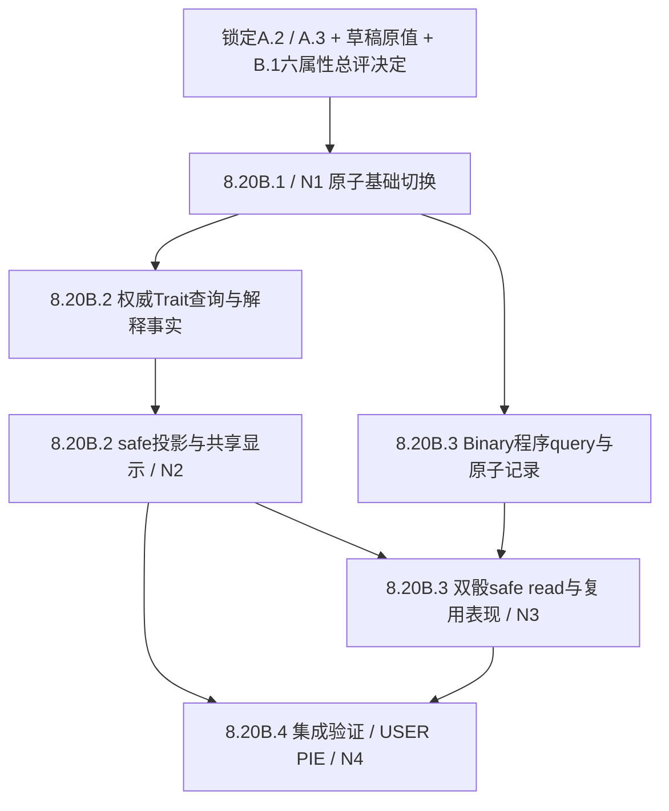

# Rules Simplification — Runtime Migration Plan

## 1. 状态、基线与结论

**当前实施状态：B.1、B.2、B.2.1 已提交；B.3 Binary 单事件双骰已实现，等待 USER PIE 视觉验收；B.4 集成收尾尚未实施。** 下列原始审计基线保留供追溯。

审计日期：2026-10-02。实际基线：`main` / `eb51165d1a85f8d8c05018640f331536e52981c6`，提交标题 `Stage 8.20A.3: lock ranked trait effect contract`。开始时 staged 0、modified tracked 0、deleted tracked 1、untracked 0；唯一删除是预先存在的 `ContentSource/PlayerContent/~$FMCodex_Rules_Simplification_Draft.xlsx`，属于 Excel 临时锁文件，不在本阶段范围，未处理。

未来规则只采用已锁定的 [A.2 Formula Contract](Rules_Simplification_Formula_Contract.md) 与 [A.3 Trait Contract](Trait_System_Design_Contract.md)。下文审计表描述 B 规划节点的旧属性/schema v3 基线；Stage 8.20B.1 已实施 schema 4、六属性基础 Formula、体力与被动 Trait 存储。B.2 已启用 23 Ranked 效果、权威属性事实与共享解释显示；B.3 已启用实际 Runner Binary 双骰。不修改上述锁定合同。PassControl / 传控暂时退出目标战术，不能借迁移恢复或重新设计其三个公式。

建议 **one-shot schema cutover**，不建立双 schema 运行时。将数据、六属性基础 Formula、体力与基础显示合为一个完整切换节点；随后分别完成 Ranked Trait（含权威解释事实与显示）、AntiOffside Binary（含原子双骰与显示），最后进行集成收尾。开发工作可拆分，不能提交只换 JSON 却仍依赖旧属性的不可运行节点。

**B.1 用户新决定已替代 B 规划的临时隐藏方案：**启用非 GK 显示总评 `Clamp(59 + Shooting + Passing + Control + Speed + Strength + Defense, 65, 95)`；仅 base 六项，不计 Trait、体力、稀有度或临时修正，不参与玩法。GK 总评保持原样。

## 2. 生产内容与模型依赖

### 2.1 当前可复现链路

`canonical XLSX + identity/presentation sidecar → Python importer → generated JSON → runtime catalog → FPlayerCardData → authoritative rule snapshots → frozen actual participants → Formula / Recovery → viewer-safe presentation`

| 边界 | 当前证据与约束 | 迁移需要 |
|---|---|---|
| 工作簿 | [Canonical workbook](../../ContentSource/PlayerContent/FMCodex_Canonical_Player_Content.xlsx)：`球员配置`、`编辑说明`；主表 40 人，32 列，旧场上十属性与 GK 六属性，数值验证 1–6 | 显式更新表头、说明、验证和 Trait 存储列；不按旧值平均自动生成已由用户填写的新值 |
| sidecar | [CanonicalPlayerImportConfig.json](../../ContentSource/PlayerContent/CanonicalPlayerImportConfig.json)：稳定 playerKey、表现元数据；当前 schemaVersion 3 | 保留身份、球队、顺序、显示名及美术关联。其形状未改时不因 runtime JSON 升版而机械改 sidecar 版本 |
| importer | [ImportCanonicalPlayerContent.py](../../Scripts/ImportCanonicalPlayerContent.py)：`SOURCE_HEADERS`、`parse_players`、`OUTFIELD_ATTRIBUTES`、`resolve_sheet_path`、`read_sheet_rows` | 当前校验表头名称和顺序；按 sheet 名解析关系，不是任意首张表。旧字段集 `SHO/DRI/PAS/OFF/MRK/TKL/SPD/STR/STA/LS` 必须整体替换；JSON key 改名必须与 C++ 同步 |
| JSON | [CanonicalPlayerContent.json](../../Content/Data/CanonicalPlayerContent.json)：schema 3、`Prototype40_v2`；38 个非 GK、2 个 GK；无 Trait / StaminaTier | 建议 runtime schema 4，独立递增 balanceContentVersion；仍由 importer 生成，保留 sourceWorkbookSha256 与可复现顺序 |
| loader | [FMCodexPrototypeTeamContent.cpp](../../Source/FMCodex/LocalPlay/FMCodexPrototypeTeamContent.cpp)：`LoadCatalog` 严格检查 schema=3；`TryReadOutfieldAttributes` 要求恰好 10 项；`AttributesInRange` 逐字段检查 1–6 | 同步改严格字段集、类型、版本和范围；失败时不发布半份 catalog。Editor 与 packaged 继续读取同一 UFS JSON |
| authoring / runtime card | [PlayerCardTypes.h](../../Source/FMCodex/CoreRules/PlayerCardTypes.h)：`FPlayerAttributes` 十个 int32，UPROPERTY / BlueprintType；`FPlayerCardData` 持有它和独立 GK 属性 | 六个明确的基础数值字段；体力层级和 Trait 独立于这六项。反射字段变更需要 UHT，不能只验证 Python |
| authoritative snapshots | [PlayerCardRuleSnapshot.h](../../Source/FMCodex/CoreRules/PlayerCardRuleSnapshot.h)、[MatchPlayCardSnapshotAuthority.cpp](../../Source/FMCodex/CoreRules/MatchPlayCardSnapshotAuthority.cpp) 的 `ProjectCard`、[snapshot validator](../../Source/FMCodex/CoreRules/PlayerCardRuleSnapshotValidator.cpp) | 快照必须复制和校验层级 / Trait；不能仅给显示卡添加字段。查询会重新验证 snapshot set，不能将增强后的属性写回基础 snapshot |
| 冻结 / normalization | [BoundActionParticipantNormalizationQuery](../../Source/FMCodex/CoreRules/MatchPlayBoundActionParticipantNormalizationQuery.cpp) 与 [types](../../Source/FMCodex/CoreRules/MatchPlayBoundActionParticipantNormalizationTypes.h)、各 route state / resolution session | 当前显式复制十属性；冻结实际身份及新基础事实。后续重建、校验、复制和 equality helpers 都要覆盖新字段 |
| 网络读链 | [InteractionView](../../Source/FMCodex/LocalPlay/FMCodexLocalMatchInteractionView.cpp) 的 `BuildForViewer` → [NetworkMatchPresentation](../../Source/FMCodex/NetworkPlay/FMCodexNetworkMatchPresentation.h) → owner snapshot / shared screen | 网络传的是安全 UMG presentation DTO，不是 raw FPlayerCardRuleSnapshot / FMatchPlayState。扩展安全 term 元数据；不发送 RNG、未披露结果或原始 Session |

当前 importer 还校验：40 人、每队 20 人、RosterSlot 1–20、身份唯一、GK / outfield 互斥、数值整数 1–6、最多 3 个技能、TP 2–8 且每人每点最多两个选项、显示名完整。`--write` 在全部验证后原子替换输出，`--check` 检查生成结果及 provenance。当前技能分配 31 项，PassControl 为 0；其枚举、解析和旧代码仍存在。[Canonical content contract](../Canonical_Player_Content.md) 与 [Data Schema](../05_Data_Schema.md) 记录的是当前 v3，未来实施时需同步，不能在本次提前改成已实施。

### 2.2 用户草稿的提升边界

已只读检查 [Rules Simplification Draft](../../ContentSource/PlayerContent/FMCodex_Rules_Simplification_Draft.xlsx) 的七张表。`AttributeMigrationDraft` 保存用户新 Shooting、Control、Defense 与 StaminaTier；Passing、Speed、Strength 从当前 canonical 保留。以稳定 playerKey 对齐草稿和 sidecar，并核对队伍 / 原身份，不能以行号或中文显示名当身份。`TraitMigrationDraft` 的 23 个 Ranked 列为 S/A/B 或空白，Binary 为“有”或空白；`TraitCatalog` 的 24 项效果是已批准、未实施。

体力核对结果：38 名非 GK 为 **8 S / 22 A / 8 B**，每队 **4 S / 11 A / 4 B**；两名 GK 不填体力。实施时逐值复制用户最终数据，保留 draft 与审查备注；不从旧 TKL/MRK、DRI/OFF、LS 再计算用户已决定的新值，不自动填充或平衡 Trait。

### 2.3 最小目标表示与校验

- `FPlayerAttributes`：显式 `Shooting / Passing / Control / Speed / Strength / Defense` 六个 int32。基础范围继续 1–6；GK 六项独立，不合并为 Defense。
- 独立语义 `StaminaTier` enum（S/A/B，另可有用于未设置 / GK 的 None）；非 GK None 非法，GK 不产生体力参与者。一个 CoreRules helper 映射 **S→5 / A→3 / B→1**，Recovery 与所有 Formula 参与者输入共同调用。
- `RankedTraits`：有界 `{ StableTraitId, Rank }` 集合；Rank 为语义 S/A/B，一个 helper 映射 **S→3 / A→2 / B→1**。`BinaryTraits`：有界 stable ID 集合，只有存在 / 不存在，不伪造 Rank。
- JSON 建议显式六属性对象、`staminaTier` 字符串、`rankedTraits: [{id, rank}]`、`binaryTraits: [id]`；GK 省略 outfield / stamina 且不接受当前 taxonomy 的 Trait。非 GK 的空 Trait 集合合法，缺必填属性不使用默认值掩盖。
- 稳定 ID 使用字面量命名空间，如 `Trait.LongShotCarrier`、`Trait.NearFreeKickTaker`、`Trait.ThroughBallAntiRunner`。实施时将 A.3 的 24 个临时键一次性显式映射到固定 registry；不能运行时从中文名拼 ID、使用数组位置作身份，或把临时键未经登记直接视为永久合同。中文名 / Rank 显示由集中式 FText 映射提供。
- 导入端与 runtime validator 均拒绝：字段缺失、额外旧字段、非整数 / 越界 base、非法体力、未知 ID、重复 ID、非法 rank、Binary 带 rank、Ranked 缺 rank、GK Trait、同一实际参与者在一个适用上下文同时匹配多个 Ranked。后者通过固定 registry 的 Tactic+实际 Route/Method+Role 交集检查，不按名单静态 Position 筛选。
- 保留当前 roster / team / stable ID / skill / TP / 顺序 / presentation 验证。检查两队体力分布是“原值保留”证据，不把固定 S/A/B 人数写成未来所有名单的玩法限制。

## 3. Legacy 依赖与兼容性

| 子系统 | 显著旧依赖 | 必须处理的边界 |
|---|---|---|
| 基础模型 / importer / loader / fixtures | 十字段、十项 range validation；各 fixture 逐项赋值；JSON 十字段计数 | 必须同节点切换。不是只改几个战术名称；不允许新 Defense 复制成旧 TKL/MRK 等隐藏兼容值 |
| 单人 Formula | LongShotDirectShotPlanQuery 选择 LS / TKL；CutInsideShotDirectShotPlanQuery 使用 SHO/DRI 差值表达平均；SingleCardFormulaInputContract / assembler 的旧属性枚举 | 新真实 operand 进入既有算术；CutInside 防守也改为同一 Marker 两项平均。删除属性引用，不重编号仍需保留的其他反射枚举 |
| 复合 Formula | Cross Low 的 SHO/MRK，Feet 的 OFF/TKL/MRK，Behind 的 MRK；各 Plan 把数值体力复制到实际参与者数组 | 同步 Plan、resolver input、状态再验证与投影；不能只改最终 resolver 的一个 switch |
| 定位球 | Long FK 使用 LS；Low Corner 使用 Runner SHO / Helper MRK；Near/Penalty 已使用 max(SHO,PAS) | 迁移属性同时保留程序方法、GK 项和 max；Corner 从已选 Runner/Helper 取值，不从候选或 Carrier 取值 |
| Recovery / tie | `MatchPlayRecovery` candidate 构建与提交前二次校验直接读数值 STA；单人 assembler、Cross orchestrator、Feet/P1 Plan、定位球输入重复读取 STA | 共用映射 helper，但继续由各消费者提供既有实际参与者集合；不改变共用 tie 的顺序 |
| 展示 / 静态规则 | InteractionView 的十属性卡片、UMG set-piece 字符串、TacticalRuleDescription、PlayerUIPresentationText、Formula attribute enums | 卡片改六属性+等级体力；静态战术信息改新规则。Live Formula 不从静态说明重新计算；检查旧 fallback / legacy consumers |
| 总评 | [FMCodexPlayerOverall.cpp](../../Source/FMCodex/LocalPlay/FMCodexPlayerOverall.cpp) `CalculateOutfield` 从十项含 STA/LS 取最高六项 | B.1 已改为集中式六属性总评 65–95，覆盖 Hand / Pitch / Full Card；仅显示，门将不变 |
| 暂退 PassControl | 三个 `PassControl*AdvancePlanQuery`、orchestrator、投影、规则说明及旧测试仍编译并访问 DRI/OFF/TKL/MRK | 不为它设计六属性公式。基础切换中将旧数值路径收口为明确 unsupported / 不可达能力，保留必要稳定 enum / wire 身份和现有生产不可选边界；更新编译依赖和相应不可用测试。不得为了让旧测试通过重新暴露战术或保留第二套玩家属性 |
| DEV / Network / test 装配 | LocalDemoConfiguration、NetworkMatchRuntime 的测试 / DEV 数据、各 TestFixture、snapshot copying / equality | 为编译和事实一致性做必要 fixture 迁移；DEV 不能成为生产 Trait、RNG 或法则来源 |

搜索须区分属性 `.LongShot` 与仍有效的战术 / route 成员 `LongShot`。不能全局替换枚举或名称；远射战术继续存在，只移除独立基础属性。

现有 C++ 搜索未发现玩家属性的独立 SaveGame / 自定义磁盘序列化兼容读取器；`ExecuteSerialized` 是 Session 串行命令执行，不是存档格式。网络 typed payload 的 NetSerialize 序列化选择 / intent 身份，不接收客户端属性。此结论不等于证明所有二进制 UE 资产没有旧反射字段：实施节点需检查真实引用并通过 UHT / build / 加载验证，不能宣称混合版本存档、在途比赛或旧客户端可继续工作。

**选择一次切换的理由：**当前 importer、loader 与 C++ 字段紧耦合，且 loader 本就只接受一个 schema；没有已确认必须支持的 v3 外部消费者。临时同时接受新旧数据会引入两种规则、未知 Trait / 体力解释和不可逆合并映射，成本大于收益。新版本拒绝旧 schema；使用新匹配会话并让 Host / Remote 使用同版构建与内容。沿用现有初始化 / 版本检查，不在客户端添加属性 payload。若后续证据发现真实旧存档兼容需求，应另立兼容 Stage，不能现在预建。

清理目标是旧属性生产读取为零，旧数据 schema 不再被 loader 接受；draft / 历史规则与必要 reflected reserved values 可保留并注明历史，不做资产清理或批量删除。回退需用户选择完整旧提交与其成套内容；Codex 不执行回滚或 Git 清理。

## 4. Formula 迁移矩阵

以下是实现定位表，不另立规则副本。完整数值与程序合同以 A.2 / A.3 为准。`C/R/M/H/G` 为实际 Carrier/Runner/Marker/Helper/GK；`avg` 仍保留一位小数。表中“体力”均指未来层级映射后的**实际非 GK 参与者**；GK 优先级不变。

| Tactic | File/function（CoreRules） | Current attributes | Future attributes | Trait hook needed | Stamina/tie impact | UI impact | Risk |
|---|---|---|---|---|---|---|---|
| LongShot Direct | `FLongShotDirectShotPlanQuery::BuildPlan` → SingleCard assembler / finishing orchestrator | C.LS vs M.TKL | C.Shooting vs M.Defense；固定防守 +2→+3 | C Shooting、M Defense，各自匹配 | C vs M；主动 GK 时 GK 优先 | operand 名 / 固定项 / Trait 来源 | High |
| CutInside Direct | `FCutInsideShotDirectShotPlanQuery::BuildPlan` → 同上 | avg(C.SHO,C.DRI) vs M.TKL | avg(C.Control,C.Shooting) vs avg(M.Defense,M.Speed) | 仅 C Control、M Defense；同一球员的另一项不加 | C vs M；主动 GK 优先 | 两边平均与各自局部加成 | High |
| Cross High | `FCrossPlanQuery::BuildPlan` → `FMatchPlayCurrentAttackResolveSingleCardFinishingFormulaOrchestrator` | avg(C.PAS,R.STR) vs avg(M.TKL,H.STR) | avg(C.Passing,R.Strength) vs avg(M.Defense,H.Strength) | C Passing、R Strength、M Defense、实际 H Strength | C+R vs M+实际 H；主动 GK 优先 | 四角色 separate terms | Medium |
| Cross Low | 同上，actual Low | avg(C.PAS,R.SHO) vs avg(M.TKL,H.MRK) | avg(C.Passing,R.Speed) vs avg(M.Defense,H.Speed) | C Passing、R Speed、M Defense、实际 H Speed | 同 High | 不复用 High 的 Strength 或旧 SHO/MRK label | High |
| ThroughBall Feet | `FThroughBallFeetPlanQuery::Evaluate` / 内部 `BuildFormulaPlan` → Feet assembler / executor / formula orchestrator | avg(C.PAS,R.OFF) vs avg(M.TKL,H.MRK) | avg(C.Passing,R.Control) vs avg(M.Defense,H.Defense) | 四角色各自属性 | C+R vs M+实际 H；主动 GK 优先 | 复用 Theater Formula terms | High |
| ThroughBall BehindDefense P1 | `FThroughBallBehindDefenseP1PlanQuery::Evaluate` / 内部 `BuildFormulaPlan` → P1 assembler / executor | avg(C.PAS,R.SPD) vs avg(M.MRK,H.SPD) | avg(C.Passing,R.Speed) vs avg(M.Defense,H.Speed) | 四角色各自属性，仅实际执行的 P1 | C+R vs M+实际 H；无 GK | 出界不能显示未执行 Formula | High |
| AntiOffside | `FThroughBallAntiOffsideOutcomeQuery::Evaluate`、`FMatchPlayCurrentAttackResolveThroughBallAntiOffsideDecisionOrchestrator::Resolve` | 单 D6，6 成功 | 无属性 Formula；Binary Runner 才 2D6 任一6 | 仅 Runner Binary，独立程序 hook | 无 tie，无防守角色 | CompactBox / 既有 pair reveal，单一 CTA / event | High |
| OneOnOne Direct / Chip | `FThroughBallOneOnOneDirectShotFormula::Resolve`、对应 direct Plan orchestrator / ChipOutcomeQuery | R.SHO vs G.OneOnOne；Chip纯骰 | 同现有基础属性及方法 | 无 Ranked，不继承 P1/Anti 角色效果 | Direct GK 总是参与；Chip 无 tie | 新阶段清除旧 Trait 解释；保留 Theater / CompactBox | Medium |
| Near FK Direct | `FMatchPlayShortFreeKickResolution::ResolveDirectDefenseRoll` | max(C.SHO,C.PAS) vs G.Handling | max(C.Shooting,C.Passing) 保留 | 实际 Taker 两项各加同 Bonus，然后 max | GK 优先；C 体力字段仅做一致转换 | 两候选 base+bonus、权威 max 选择 | High |
| Long FK Direct | `FMatchPlayLongFreeKickResolution::ResolveDirectDefenseRoll` | C.LS vs G.Positioning | C.Shooting；固定防守仍 +2 | 实际 Taker Shooting | GK 优先 | 去除 LS 描述；Power 不加 Trait | Medium |
| Penalty Direct | `FMatchPlayPenaltyResolution::ResolveDirectDefenseRoll` | max(C.SHO,C.PAS) vs G.Anticipation | max(C.Shooting,C.Passing) 保留 | 实际 Taker 两项各加同 Bonus，然后 max | GK 优先 | 同 Near 的 max 语义；Panenka 独立 | High |
| Corner High | `FMatchPlayCornerResolution::BuildFormulaInput` / `QueryFormulaPreview` / `RequestDefenseRoll` | R.STR vs avg(H.STR,G.Aerial) | R.Strength vs avg(H.Strength,G.Aerial) | 仅选定 R Strength、H Strength；GK 无 Trait | GK 优先；候选不加入体力 | 选定身份、候选人数加成与 Trait 分开 | High |
| Corner Low | 同上，actual Low | R.SHO vs avg(H.MRK,G.Reflex) | R.Control vs avg(H.Defense,G.Reflex) | 仅选定 R Control、H Defense | 同 High | 不能套 Cross Low Speed 规则 | High |

直接实现位置以文件内符号为准；[A.2 §2 证据索引](Rules_Simplification_Formula_Contract.md#2-权威证据与参与者边界) 提供相关文件链接。下列现有边界必须随基础迁移与 Trait 迁移一起验证：

- 固定项：LongShot Direct 未来 +3；CutInside/Cross/Feet 防守 +2，Behind P1 +1，OneOnOne 攻击 +1，Near GK +1，Long FK GK +2，Penalty GK −3，Corner 防守 +2。不要把旧 `(第二属性−第一属性)/2` 的实现差值再次当作固定奖励。
- GK：普通 LongShot/CutInside/Cross/Feet 的合法主动 GK 为对应属性 ×0.5；Behind 无 GK；单刀 GK 基础 1.0，激活后合计 1.5；定位球自动 GK，无额外运动战激活；Corner GK 位于平均值内。GK 属性不应用本轮 Trait。
- 系数和 max：先解析实际角色的 base+bonus，再平均 / half / max。缺可选 Helper 为 0 项且仍除以2，无该球员 Trait / 体力；多个实际球员可同时加成。Near / Penalty 两项各增强，不能用“max 后加”替代事实模型。
- D6 / 早退：LongShot/CutInside Direct 和 Long FK Direct 攻击1–2保留立即失败；Behind P1 攻击1–2出界，均不取防守骰或 Formula。通过 P1 直接单刀，无 P2；单刀直接射门1–2仍参与比较。路线骰不当比较骰。
- 纯骰：DeadCorner / Long FK Power 的双骰阈值11、Near Angled 的基础 SHO+PAS≥8 资格及双骰阈值9、Penalty Panenka 的2–6、Chip 的4–6全部保留。Ranked 不影响资格、路线、纯骰阈值或早退。
- Corner：保留共享选人骰、实际路线、候选人数修正、零候选优先和自动 scorer 路径；未形成 Formula 的自动 Goal / NoGoal 不触发 Ranked。运动战 Tactical Player 修正不移植到定位球或 P1。
- 共用 [FormulaResolver](../../Source/FMCodex/CoreRules/FormulaResolver.cpp)：先快速压制，再 final 比较；平局先实际 GK，否则实际体力和，仍平防守胜。保留 Finishing / Transition、Goal/scorer、terminal/Advance/Recovery 生命周期。

## 5. Recovery 与 tie 的最小改动面

[MatchPlayRecovery.cpp](../../Source/FMCodex/CoreRules/MatchPlayRecovery.cpp) 的 `FMatchPlayRecoveryCandidateQuery::Build` 从双方当前 `UsedCardIds` 建立有序池，校验 authoritative snapshots；Available / Ejected 不入池，非法 Used GK 或缺 snapshot 会失败。当前直接取 `Snapshot.Attributes.Stamina`，范围1–6；resolver 提交前还比较一次 snapshot 与候选权重，必须同步改。

现有算法**已经是显式按权重、不放回抽取**：[Local provider](../../Source/FMCodex/LocalPlay/FMCodexLocalMatchD6Provider.cpp) 和 [Network provider](../../Source/FMCodex/NetworkPlay/FMCodexNetworkRandomProvider.cpp) 的 `DrawWeightedWithoutReplacement` 维护 RemainingIndices，每次求剩余 TotalWeight，抽一个 ticket、按累计权重选择、删除该 index。一次 provider 调用返回两名不同候选；零人 / 一人池不消耗 RNG。无需复制权重份数的数组，也无需重写抽取器。

未来仅将候选来源改为 tier helper，提交前复核使用同一 helper；共享候选 / provider 验证不得仍接受来源不明的旧 STA。可在调用边界要求权重属于1/3/5；provider 继续消费经验证的正权重。实际概率是当前候选权重 / 当前总权重，第二次排除第一次选中者后重算；不是固定5/9、3/9、1/9，也不是先按档抽再选人。

Local provider 使用构造时给定 seed 的 FRandomStream，调用间继续推进；测试可固定 seed。Network 用服务器私有 PlatformCrypto entropy 与 `SampleIndex`，DEV seam 不可替代生产 RNG。每次 Recovery 重建当前池，不复用上次残余候选；同一次 draw 内才复用剩余池。pair 非法 / provider失败不提交部分归还；成功事实绑定 source AttackSequence，保留 retry/dedupe 及复制重建，不为 tier 新建 Recovery 状态机。新权重导致相同旧 seed 的选中序列改变是合理变化，不能要求与旧名单结果完全一致。

tie 的**判胜算法集中**，但 `ParticipatingStamina` 的来源装配分散：SingleCard assembler、Cross finishing orchestrator、Feet/P1 Plan、set-piece resolution 与 Formula fact projection。最小安全点是一个 tier conversion helper加这些读取点；不要让 `SumStamina` 去猜1/3/5是否代表旧值或 enum ordinal，也不要在 UMG 重新选参与者。Long/Cut 为 C vs M；Cross/Feet/P1 为 C+R vs M+存在的 H；单刀与定位球 GK 优先，GK 无体力，Corner 只选定 R/H。

## 6. Trait 权威基础与程序扩展

当前 `FPlayerCardData`、snapshot、normalized participant 没有 Trait ID/rank/assignment。已有 `Modifier`、`TacticalPlayerModifier`、candidate bonus 和 GK contribution 是各自既有规则，不是可复用的 Trait 存储或激活框架。

建议新增一个小型、明确的 CoreRules Trait registry / query：输入是已验证的实际 tactic、actual route/method、角色身份及冻结 assignment，输出该次参与者的属性增强事实。每个 Formula 构建点调用它，通用 `UFormulaResolver` 仍只做现有算术和判胜，不负责从球员、Position 或 UI 查 Trait。至少两个真实消费者共用同一个 query / fact 类型；不建立 buff生命周期、优先级、堆叠或通用 RPG 引擎。

Ranked 事实最少包含 stable Trait ID、rank、实际 CardId/role、attribute、base、bonus、effective、原 coefficient 与 contribution。同一人双属性 Trait 是一份匹配结果作用于两个 operand；不同人可各有匹配。同一人两个匹配是配置错误，应在内容验证阻止并由 runtime防御性拒绝，不能 first-wins。状态保存 base / assignment 和既有实际绑定；重建时经同一个权威 query 产生相同解释，不把加成持久化写回 base 或每帧累加。

**AntiOffside 不能只是把成功条件改一行。** 当前 OutcomeQuery 接收一个 D6；orchestrator 的 adaptation 要求一个 initial route record、一个 primary roll；PostRouteRollProgressQuery 在单刀选择 / direct continuation 中直接要求 `Records[0].RawD6 == 6`，session validator / fact projection 也依赖记录数量和索引。必须共同扩展为明确的一次 AntiOffside 事件，包含普通一骰或 Binary 两个子 operand，并用权威 accepted outcome 决定 handoff。第二枚6也必须成功，不能继续只看第一枚。

复用现有 [DeadCorner paired transaction](../../Source/FMCodex/CoreRules/MatchPlayCurrentAttackResolveDeadCornerPostRouteDecisionOrchestrator.cpp) / FK 原子成对取骰方式和 Roll v2 pair reveal 能力；不引入第二个输入 / CTA / 工作流事件，不额外查询或创造防守参与者。两个 provider 取样可以在同一事务内发生；第二次失败不得发布第一枚或半个结果。失败消耗的私有 entropy 不需要倒回，但重试不能将先前未提交骰伪装成 accepted fact。

继续使用现有 typed AntiOffside action、Host/Remote generated RPC、公共 RequestId / AttackSequence 边界、共享 Session / HostPort / Coordinator。不让客户端指定骰数或 Trait 生效，服务端从实际 Runner 决定；server-private RNG、provider failure atomicity、重复 ACK/View 和终结持久化必须覆盖。不要把一事件两枚子 operand 计成两个权威玩家事件。

`FMCodexNetworkMatchPresentation.cpp` 当前拒绝超过5条 ResolvedRolls。路线1+Binary2+单刀Direct2恰好5条，不应盲目扩大公共上限；需要证明新索引/身份安排在现有限制内，且单枚/双枚路径均能重建。

## 7. 表现事实与范围上限审计

普通路径已有 [ResolutionFactProjection](../../Source/FMCodex/CoreRules/MatchPlayCurrentAttackResolutionFactProjection.h) / [builder](../../Source/FMCodex/CoreRules/MatchPlayCurrentAttackResolutionFactProjection.cpp)：结构化 Attribute / RawRoll / FixedModifier / GK / TacticalPlayer 项，当前只有 SourceValue、Multiplier、Contribution 等，没有 Trait base/bonus/effective来源。`FMCodexLocalMatchUMGPresentation.cpp::BuildFormulaRow` 将这些项变成共用 InlineFormula term VM，Theater 使用同一类 operand / tooltip。

定位球例外：同文件 `BuildSetPieceFormulaSurface` 从安全上下文拼 Near/Penalty 两属性字符串、Long LS 字符串、Corner平均字符串；不是已经具备统一 Trait facts。**迁移 UI 的前置 architecture gap** 是定位球和普通公式都提供同形状的权威 attribute-effect / selection facts。必须先在 CoreRules / safe projection foundation 补齐，再由呈现层格式化；若未来该实施阶段不包含或未完成此基础，UI接入应报告 BLOCKED，不能靠 Widget / 客户端计算补齐。

这一前置工作可作为独立的 **8.20B.2a Authority foundation** 实施阶段，沿用本Stage推荐的 GPT-6 Astra Xhigh；随后 **8.20B.2b presentation consumer** 才接显示，二者仍合并为下文N2完整提交节点。本审计可以完成，不因未来尚未实施的基础而宣称当前文档工作受阻。

| Surface / consumer | 计划变更 | 明确保持 |
|---|---|---|
| Resolution Theater / TheaterInline Formula | 共用 term formatter 接收 base、bonus、effective、Trait ID/rank与中文映射；系数 tooltip 保留准确 contribution | RHS、winner、scorer来自权威；不本地求和或判胜 |
| Near / Penalty Direct | 权威 max group 包含两个候选的各自 base+bonus/effective及选择结果；例如“射门4 +2，传球5 +2，取较高值→7” | 候选不是两个都计入总和的加法项；不在max后虚构通用+2 |
| Cross / ThroughBall / Corner | 多实际参与者各显示自己的 Trait；变更阶段清除旧解释，缺 H / 未选候选无贡献 | 两队共享屏幕、owner/waiting、static vs live facts分工 |
| CompactBox / ThroughBall anti、Chip、route | Binary事件两骰复用既有pair编排；普通route/Chip无Ranked | 外置CompactBox、既有Reel/ResultHold、一个动作与既有叙事门控 |
| HeroRoll | 入口D12 / TP的非相关消费者不改玩法或数值域 | 保留既有Roll v2；不能把增强属性当作Reel域1–6去截断 |
| 仍可达的 legacy / fallback、set-piece surfaces | 消费同一个完整safe term，或明确不提供尚缺事实的能力；同步旧属性标签 | 不建立另一套效果计算，不全局删除 InteractionPanel |
| Card / Tactical Information | 六项base与S/A/B、非GK六属性派生总评；静态说明同步A.2，Trait标签由ID映射 | 基础卡面不被临时加成覆盖，显示名和美术稳定 |

网络当前投影将安全 UMG VM 放入 owner-only snapshot；因此新 term / max group 需贯通 BuildForViewer、presentation adapter、replication DTO和客户端共享widget。合法公开的效果事实可及时复制，仍由现有 result / displayed-score gate 控制可见揭示。不得把 future roll、原始route state或未获权限的 outcome放进客户端，亦不为装饰悬念延迟服务器持久化。

**上限结论：当前 base 是1–6，不是1–5。** XLSX validation、importer、loader、snapshot validator都限制基础值。`FormulaResolver` 使用float subtotal和一位小数；`SingleCardFormulaResolutionExecutor` 检查finite，未发现将属性 Formula 截到5/6的逻辑；所查Formula文本formatter亦无此数值cap。Roll的D6/D12域和progress/opacity clamp不属于属性限制。

**MIGRATION RISK：**若把 `base+bonus` 写回受1–6校验的snapshot，合法的8/9会失败。有效值必须在独立Formula operand里表达，base5+S=8、base6+S=9都应通过。最终值不增加总cap；视图要容纳两位数和小数，不改变卡面base范围或骰子域。复用现有 [Visual Language](../UI/MatchFlow_Visual_Language_v1.md)、[Roll contract](../UI/Roll_Presentation_Visual_Spec_v1.md)，不新建Visual Language v2或Tactical Scene。

## 8. 已有验证资产与未来最小预算

**本阶段没有运行以下任何 suite。** 下表是仓库中已定位的可复用测试名称 / 前缀和缺口，不表示它们已证明未来规则。标记“前缀”的项在实现时按最终diff选相关用例；不得把整个表当每个Stage的执行清单。

| 编号 / 范围 | 已有资产 | 未来使用与缺口 |
|---|---|---|
| V1 内容 | `Scripts/ImportCanonicalPlayerContent.py --check`；`FMCodex.LocalPlay.PrototypeTeams.01.ContentCatalog`、`.02.CanonicalDataAndSkillRules`、`.08.PassControlWithdrawalAvailability`、`.03.OverallV1` | importer验证有真实实现，但未找到专门覆盖新schema错误输入的现成Python测试；需新增临时fixture的缺字段/rank/type/ID/重复匹配验证。现有 `TestCanonicalContentCompletion.py` 主要是bio/art，不冒充schema测试 |
| V2 基础Formula / tie | `FMCodex.CoreRules.FormulaResolver.Transition`、`.Finishing`、`.TieBreak`、`.SharedTiePriority`、`.FastSuppression`、`.DecimalRules`；前缀 `FMCodex.CoreRules.LongShotDirectShotPlanQuery`、`FMCodex.CoreRules.CutInsideShotDirectShotPlanQuery`、`FMCodex.CoreRules.SingleCardFormulaResolverInputAssembler` | 锁定新operand/系数/固定项，合法8/9、base不变、早退及GK/非GK平局；更新预期须来自A.2而非实现自证 |
| V3 复合分支 | 前缀 `FMCodex.CoreRules.CrossPlanQuery`、`FMCodex.CoreRules.ThroughBallFeetPlanQuery`、`FMCodex.CoreRules.ThroughBallBehindDefenseP1PlanQuery`；`FMCodex.CoreRules.ThroughBall.OneOnOne.DirectShot.FormulaContract` | High/Low真实route、缺H分母、同角色双属性、P1→单刀不继承Trait；不重复网络穷举已由CoreRules验证的数学 |
| V4 定位球 | `FMCodex.CoreRules.MatchPlayShortFreeKick.DirectFormulaAndRetry`、`.AngledAtomicThresholds`；`FMCodex.CoreRules.MatchPlayLongFreeKick.DirectConditionalAndFormula`；`FMCodex.CoreRules.MatchPlayPenalty.DirectFormulaModifierScoreAndScorer`、`.PanenkaOneTwoSixAndNoFormula`；`FMCodex.CoreRules.MatchPlayCorner.IntentRouteFormulaPrecisionAndRetry`、`.SharedD6MappingAndCandidateModifiers`、`.ZeroPrecedenceAutomaticGoalAndConsumption` | max两输入增强、Corner仅选定R/H、pure-D6/资格/zero路径无Trait，沿用事务retry |
| V5 Recovery | 前缀 `FMCodex.CoreRules.MatchPlayRecovery`，含 `.ProviderFailureAndMalformedPairAreAtomic`、`.GoalkeeperAndInvalidStaminaCannotEnterPool`；`FMCodex.NetworkPlay.RNGPrivacy.03.WeightedRecovery`、`.05.EntropyFailureNoStateAdoption` | 1/3/5来源、剩余池重算、0/1/多候选、两人不同及失败不部分提交；不进行蒙特卡洛概率回归 |
| V6 Binary | 前缀 `FMCodex.CoreRules.ThroughBallAntiOffsideOutcomeQuery`；`FMCodex.NetworkPlay.ThroughBallConditionalTransport.Security`、`.WrongRoutesBranchesAndStale`、`.Disclosure` | 现有为单骰，需新增同事件36对、第二骰6、两枚6仍一次、无Trait仍1骰、错误持有角色、第二次provider失败、continuation/reconstruction/去重。数学36对仅在CoreRules证明一次 |
| V7 UI | `FMCodex.LocalPlay.FormulaFamily.ReadableStatesAndReuse`；`FMCodex.LocalPlay.ThroughBallProductionPresentation.FeetFormulaRevealTerminalAndResync`、`.AntiAndChipGoldenPaths`；`FMCodex.LocalPlay.ResolutionTheater.NearFreeKick.Lifecycle`、`.LongFreeKick.Lifecycle`、`.Penalty.Lifecycle`、`.Corner.Resolution` | 无现成Trait UI测试；新增`5 +1 / Trait B`与双候选max事实、8/9、长中文及角色归属、ResultHold后结果；沿用family，不重建视觉系统 |
| V8 Network / runtime | `FMCodex.NetworkPlay.CrossContestTransport.06.AckViewOrder`、`.08.SafeProjectionAndScoreGate`；`FMCodex.NetworkPlay.MarkerRecoveryUI.RecoveryHandsAndNotification`；`FMCodex.NetworkPlay.NearFreeKick.SharedUI`、`.Penalty.SharedUI`、`.Corner.SharedUI`；对应Session/Coordinator测试与前缀 `FMCodex.MatchPlayRuntime` | 聚焦同safe事实、public边界和retry；不能以直接调用fixture代替真实generatedRPC。新fields的schema/复制证据与runtime规则证据分开 |
| V9 PIE / 真实Golden Path | `FMCodex.PIE.ThroughBall.FullFlow.Feet`、`.BehindDirect`；`FMCodex.PIE.ThroughBall.Polish.AntiOffside`；`Scripts/NetworkPlay/LaunchNetworkPlayDev.ps1` 与 `Test-NetworkPlayDev.ps1` | 已有自动PIE / 双进程DEV设施可适配；不是Trait验收现成通过。未来 milestone USER PIE REQUIRED，截图/工程PIE不得冒充用户接受 |

新Trait测试应覆盖23项registry的声明映射和不同实际参与者可同时生效、同人冲突拒绝、基础卡不改、应用在系数前、stage隔离；使用参数化fixture避免为每一项复制整套网络流程。所有未来实现节点保留 `git diff --check`，根据 public USTRUCT/header 改动做必要 UHT / 增量 Development Editor build，不默认 clean rebuild。

## 9. 建议实施顺序与提交节点

采用四个实施阶段。下述文件集合是影响域，实施前仍核对实际diff。每个节点由用户手动staging/commit；中间节点明确标注未完成8.20，不能宣称整体生产验收。

### 8.20B.1 — 原子基础切换

- **范围 / 文件：**canonical XLSX、importer、JSON、PlayerCardTypes / snapshot / normalized values / validators；§4所有保留战术的基础Plan/resolution/assembler/projection；Recovery输入映射；卡片六属性 / 体力、静态战术说明、基础Formula标签与六属性总评；必要DEV/fixture及暂退PassControl旧字段编译收口。更新当前 Rules Canonical / Data Schema / Canonical content文档。
- **实现合同：**A.2六属性完整映射与固定项、S/A/B→5/3/1、内容逐值保留、schema4严格读取。预留并实际加载冻结23 Ranked+1 Binary assignment数据，但该节点尚不启用效果，也不向玩家把其显示为已生效；明确它是内部迁移节点。
- **依赖：**本计划、锁定A.2/A.3和用户总评决定；内容提升、字段建模、基础Formula、体力可以分工作包，但完整节点必须一起可编译、可运行、可解释。
- **排除：**Ranked / Binary玩法生效、新战术、新Roster值、Visual Language重设计、兼容双模型、泛化重构。
- **最小验证：**V1 importer临时fixture+`--check`+生成差异与40人原值对账；V2–V4只选受改分支算术及关键早退/GK/系数边界；V5权重/体力与failure原子性；V7基础字段/六属性总评；V8一个相关safe投影 / recovery UI参数化检查。UHT+增量Editor build。用户在基础显示milestone验收，不为每个工作包重复PIE。真实Host/Remote暂不跑，留B.4。
- **提交关系：**节点N1合并数据/模型/基础Formula/体力/基础显示，不能独立提交“数据已换、旧Formula待改”。若用户不希望保存无Trait效果的内部节点，可与N2/N3合并提交；无须为此引入运行时双版本。

### 8.20B.2 — Ranked Trait 与权威解释事实、显示

**实施状态（2026-10-03）：**已接入共享权威 Formula。`FPlayerTraitFormula` 按 stable ID、当前 Formula context 与实际角色解析 B/A/S→1/2/3，产生 base / bonus / effective 事实；不写回 snapshot，不截断有效值。普通战术与定位球消费同一查询，Near / Penalty 两项分别增强后取 max，定位球持久状态重建也复用该查询。Corner 只披露选中者，ThroughBall 后续单刀重新使用自身合同；反越位仍是原单骰。共享 Formula term 和既有 Theater 基础值悬浮解释展示各参与者原值、加成、中文来源；不改 Roll v2 布局。生产 roster、OVR、Stamina、Recovery 和 tie-break 规则不变。工程验证记录见 Decision Log；USER PIE REQUIRED，不将自动 PIE 等同用户验收。

- **范围 / 文件：**小型CoreRules Trait registry/query/helper；实际Formula构建点（普通/复合/定位球）；ResolutionFactProjection、set-piece progressive facts、InteractionView / BuildForViewer、UMG term/max group、NetworkMatchPresentation与相关widget/中文映射。同步合同实施状态。
- **实现合同：**23项固定映射、rank+3/+2/+1、实际role/actualroute、系数前增强；Near/Penalty双属性增强再max；UI同时展示base、bonus、来源和权威选取结果。结构化facts先完成，再开放UI消费；基础属性不改。
- **依赖：**N1的新模型、实际绑定和基础公式；§7的authority/safe projection foundation是本节点的先行工作包。可以提前用纯fixture开发registry/query和term显示，但不能提前接生产数据或用UI推导效果。
- **排除：**Binary双骰、新Trait、GK Trait、Position激活、纯骰/资格增强、通用buff框架或任何名单再平衡。
- **最小验证：**新增registry/activation参数化测试，V2系数前8/9与base不变，V3实际多角色及stage隔离，V4max与Cornerselected、纯骰无影响；V7共享term/max展示和相关set-piece/ThroughBall消费者，V8安全字段、重复View/ACK与比分门控。按public字段做UHT/增量build。可见效果完整后USER PIE REQUIRED；真实Host/Remote留B.4，不跑所有网络数学矩阵。
- **提交关系：**N2将Ranked玩法、权威facts、安全投影和透明显示作为一个可审查节点；不提交已生效但只能看到“射门6”的隐藏加成版本。Binary仍明确未完成。

### 8.20B.3 — AntiOffside Binary 单事件双骰

实施采用一条 PrimaryAttack 事件记录加可选第二骰，未增加 purpose、SequenceIndex、CTA 或工作流阶段；路线 + AntiOffside + Direct 两骰仍为四条事件，现有安全 DTO 上限不变。两枚结果原子提交／披露，共享 CompactBox 使用同一 reveal/hold 时钟并列显示。B.4 继续负责 broad integrated / 独立 Host/Remote 收尾。

- **范围 / 文件：**AntiOffside query/orchestrator、post-route progress / session validators、typed Session continuation、accepted roll facts与safe DTO / bounded roll lists、DEV注入及共享CompactBox/pair reveal。
- **实现合同：**实际Runner持有Binary时同一动作/同一权威事件2D6任一6；无Trait时保留1D6；原子取样、后续单刀与重建接受第二枚6，原有命令/actor/security/RNG边界不变。
- **依赖：**N1 assignment与snapshot；复用N2事实/显示基础后接入最省重复工作。程序query可先独立用fixture开发；无理由把这一不同lifecycle边界强并入Ranked算术。
- **排除：**第二CTA/事件/阶段、防守方或Formula、新网络命令、客户端骰数/结果输入、其他纯骰方法重写。
- **最小验证：**V6关键新合同与failure/retry/stale/wrongactor/去重，沿用V8公共validator；V7两个子operand逐枚揭示及同一事件身份、V9相关自动PIE可按实际需要选一条。必要UHT/build与diff检查。成对动画/流程USER PIE REQUIRED，可与B.4合并一次验收，不逐补丁重复。
- **提交关系：**N3程序权威+持久化/重建+safe read+共享表现完整节点。仍不以自动PIE代替用户验收。

### 8.20B.4 — 集成验证与迁移收尾

- **范围 / 文件：**最终实际diff的focused/affected复核、跨战术真实流程、内容可复现性、规则/数据文档实施状态、必要缺陷修复与遗留属性读取核查。
- **实现合同：**A.2/A.3整体可玩且真实解释一致；数据/Formula/Traits/Recovery/tie/终结及比分揭示形成完整链；PassControl仍暂退、无双schema运行时。
- **依赖：**N1+N2+N3以及所需USER PIE接受。不是再设计算法或填充内容的阶段。
- **最小验证：**复用已经充分的V1–V8结果；在最终节点集中跑一次受全局六属性/体力/Formula影响的 `FMCodex.CoreRules` 与 `FMCodex.MatchPlayRuntime` broad suites，理由是全局规则/共享状态输入迁移，不是每个小Stage机械要求。LocalPlay选V1/V7及实际改动的Roll/Screen集合；若最终修改共享Screen核心状态机，再升级相应LocalPlay全量。Network默认V6/V8受影响安全/投影/ACK测试，不全量复跑各战术骰子数学；仅在公共envelope/全局disclosure/replication语义实际改变时升级full NetworkPlay。
- **真实流程预算：**一条独立Host/Remote generatedRPC Golden Path：优先有Binary的AntiOffside→OneOnOne Direct→terminal/Advance/Recovery；同时观察至少一个已选其他位置球员的Ranked公式可用日志/Local automation证明，不强塞进这条不触发Ranked的单刀流程。A/B对称性用参数化。需要额外专门双属性max视觉证据时用Local USER PIE，不新增第二条网络Golden Path。服务端DEV provider注入允许，客户端不得指定骰或跳生命周期。
- **完成门槛：**受影响最终target verification、内容再生成一致、真实runtime证据与USER PIE milestone结论、diff范围检查；不能因测试总数大就通过。没有改Shipping条件或平台打包路径时不默认额外Shipping build。主动省略未受影响美术/外部素材/全量网络等，并报告理由。
- **提交关系：**N4为集成修复/文档收尾节点；若没有实现修复，只提交必要实施记录。最终是否合并N1–N4由用户手动决定，不由Codex操作Git。

## 10. 依赖图与可独立工作

N1内部依赖是：草稿提升映射与严格schema → card/snapshot/normalization → 基础Formula及tier输入 → 对应safe facts/卡面/说明 → 完整验证。可以独立设计/测试 importer临时数据、tier转换、Trait registry参数化、Binary纯query和只读term formatter；生产连接依上述顺序，不能声称这些独立测试已验证完整Local/Network流程。

## 11. 风险与剩余决定

| Risk | Severity | Why | Recommended mitigation |
|---|---|---|---|
| schema / loader / 旧字段不同步 | High | 严格v3+10字段与大量编译读取相互依赖 | N1一次切换；无旧值重建别名，base/JSON/fixture逐项核对 |
| 草稿提升覆盖用户值或身份 | High | draft新值与生产部分旧值分处不同来源，临时键非永久身份 | stable playerKey校验，逐值对账并保留元数据/原草稿，不重新平均或自动平衡 |
| 平均与modifier实现混淆 | High | 旧Plan用差值modifier表达平均，CutInside防守也有新结构 | 明确operand→effective→coeff；验证合成最终输入与解释事实一致 |
| 体力来源漏改 | High | 单一tie算法但多处参与者装配，Recovery有提交前二次校验 | 统一映射helper、全调用点清单，实际参与者/GK/缺H边界 |
| Near / Penalty max回退或丢解释 | High | 单一数值不足以解释两个候选均增强 | max group记录两项base/bonus与权威选择；纯骰资格用base |
| Corner / ThroughBall错误角色、跨阶段效果 | High | 候选/历史Carrier/Marker不等于本次实际参与者 | 绑定actual route/role，selected-only，单刀/Anti/zero路径否定用例 |
| 有效属性8/9被base validator拒绝 | High | snapshot max6；错误回写可能污染持久状态 | 独立effective operand，base仍1–6，不截断也不加最终总cap |
| Binary单骰数组假设 / 第二次取样失败 | High | record count、index和后续“第一枚必须6”都已有硬约束 | N3单事件原子pair，接受第二枚6、重建/去重/失败原子验证 |
| 定位球没有Trait解释facts | High | 当前set-piece单独格式化base字符串 | 先补authority/safe foundation，再共用term；缺事实时阻止UI接入 |
| 网络披露/事件边界 | High | 新operand不能越过viewer权限或产生重复result | 保持serverRNG+typedRPC+owner-safe DTO；针对性security、ACK/View和一条真Golden Path |
| 暂退PassControl仍编译 | Medium | 删除通用旧字段也影响不在生产名单中的旧plan | 明确unsupported编译收口，保留必要身份，不发明新Formula或扩大恢复范围 |
| UE反射 / 缓存 / 旧会话 | Medium | USTRUCT字段和static catalog形状改变，未证明混版本兼容 | 必要UHT/build/loading，新版新会话，同版Host/Remote，不默认旧save兼容 |
| 中文显示 / 字段宽度 / 非GK总评 | Medium | 旧十属性、max解释和8/9影响布局，总评旧算法失效 | 同步基础显示、复用family，落实六属性总评并USER PIE |
| 新Trait ID与中文标签绑定 | Low | 技术上可用固定registry直接解决 | 稳定字面量ID与FText映射分离，禁止显示名作权威身份 |

**Remaining product decisions: None.** 总评由 B.1 新决定启用六属性 base sum 的 65–95 映射，原暂时隐藏计划被明确替代。字段名、schema版本、registry固定ID和DTO形状是按本计划收敛的技术实现工作；不重开A.2/A.3。

## 12. 本阶段验证预算与非实现确认

本Stage实际只做：仓库引用搜索与直接消费者追踪、两份锁定合同对照、工作簿/JSON只读结构与名单核对、阶段依赖/提交节点一致性检查、文档链接与Git范围/空白检查、受保护文件SHA-256前后比对。验证预算不含任何gameplay automation；§8–9均为未来预算。

未改runtime gameplay、Formula实现、canonical workbook、生成JSON、importer、Trait runtime、Recovery、tie-break、UI、用户draft值、阵容、技能分配或A.2/A.3合同。未运行build、UHT、PIE、gameplay suites或Host/Remote Golden Path；文档审计不触发这些验证。**REGRESSION SCOPE JUSTIFIED: YES。**

本阶段只新增本计划并在Decision Log追加规划和用户总评决定；Excel锁文件既有删除保持原样。未staging或commit。推荐用户手动提交信息：`Stage 8.20B: plan rules simplification runtime migration`。
