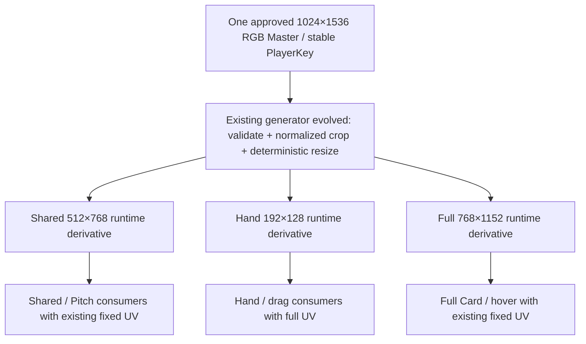

# Player Art Architecture v1 — Canonical Master → Derived Runtime Assets

Stage: `8.1B` · Baseline: `main / 2d33963bdb36f3ea41ba0c6ce2738cd849e82aa1` · Date: `2026-09-10`

Current production revision: **Player Card Family v1.3 — USER PIE ACCEPTED**. Canonical coverage is **40/40** (Arsenal 20, ManchesterCity 20); all **120/120** Hand / Shared-Pitch / Full roles are **USER PIE ACCEPTED**. The user explicitly reports FINAL 40/40 USER PIE PASS for the final twelve families and the five existing families' changed Hand/Shared roles. Hand uses **BalancedBust_v3**, Shared/Pitch uses **QuietPitchBust_v3**, with **SourceSpaceForeground_v3**; Full retains **CropOnly_v1** directly from the same Master. Section 30 is the permanent future-player gate, section 36 defines the hash-bound preflight mechanism, section 39 records the historical migration checkpoint, and section 40 records final acceptance. Earlier dated coverage, candidate and pending statements describe historical checkpoints only.

Accepted baseline: **PLAYER CARD FAMILY v1 FROZEN FOR ROSTER MIGRATION.** Stage 8.2A Hand, 8.2B Pitch Mini and 8.2C Full are USER PIE accepted and committed; Stage 8.2D family audit is closed. Current acceptance baseline: `b9774ec5e7b0af401618c716ace59d3f65d863e3`. The Stage 8.1B baseline and dated sections below remain historical; their pending/deferred wording describes those checkpoints, not current acceptance.

This is the **single canonical player-art architecture**. The historical filename is retained to consolidate the existing Shared contract and preserve incoming links. It supersedes that contract's Shared-only source ownership, and the independent Hand/Full authoring and source-workflow rules in [Portrait Asset Spec](Portrait_Asset_Spec_v1.md). [Hand Micro Visual Spec](HandMicro_Visual_Spec_v1.md) still owns frozen card geometry/typography; [Shared Artwork Manifest](Shared_Portrait_Artwork_Manifest_v1.md) remains the historical coverage inventory. Existing assets, v1 manifests, hashes and routing remain valid legacy production until explicitly migrated. This specification is not authorization to generate a roster, import assets, change widgets or delete legacy art.

## 1. Current audit and truth boundaries

The Stage 8.0 source/Texture2D audit remains applicable: no changes between audit commit `46f344779da90475d08a15728de4d14e27ea4f3d` and this baseline in player source art, portraits, ContentSource, the audited generators/importer, PlayerCardWidget or PlayerUIAssetReferences. Targeted 8.1B checks snapshot 264 protected files, re-read actual consumers/settings and inspect three source PNGs. Evidence lives in `Saved/Automation/Stage8_0/` and review-only `Saved/Stage8_1B/`; no repeated full asset scan or new cook is needed.

| Current role | Routes | Imported size / actual settings | Source ownership today |
|---|---:|---|---|
| Shared / Pitch | 28 | 20 at 512×768, BC7, Sharpen1 mips, trilinear; 8 older 1024×1536, Default compression, no mips | Shared-specific masters |
| Hand Micro / drag | 16 | 192×128, BC7, Sharpen1 mips, trilinear | Independently authored 1536×1024 candidates and explicit legacy crops |
| Full Card | 16 | 1024×1536, Default compression, no mips | Separately authored FullCardPilot / FullCardHeroBust PNGs |

All 60 mapped player textures are sRGB, UI group and NeverStream in the saved metadata. `TC_DEFAULT` does not by itself prove a particular cooked GPU format; opaque BC1 was the Stage 8.0 payload assumption. Shared/Hand use BC7 in the current desktop implementation. Current Full importer/validator enforce dimensions, UI and sRGB but do not lock the other settings.

The 40-player coverage is **16 all-three / 12 Shared-only / 12 missing**. This is technical routing coverage, not 16 approved single-master identities. No player is newly certified `ProductionVerified` here. Multiple images are mostly independently maintained art, not exact duplicate PNG hashes. The 90 historical Hand candidates occupy 171.04 MiB; they are not 90 runtime textures.

Runtime truth remains `FFMCodexPlayerUIAssetReferences::ResolveCardArt(CardId)` and the existing presentation DTO. Art metadata never owns stats, rarity, legal actions, phase, score, identity disclosure or localized player names. No Gameplay/CoreRules/Network/PlayerIntent/lifecycle changes are part of this lock.

## 2. Frozen architecture and minimum physical assets



There are **three logical roles and three physical runtime textures per player** in desktop v1. This follows the actual 1440p resolution comparison: Full requires a different size from Shared. They may have the same whole-master framing but cannot alias the same physical texture without either weakening Full quality or making Pitch load the larger texture. No separately authored Pitch image is added. No current mappings are changed in 8.1B.

Pitch Mini continues to use Shared. Its 130×112 region at design scale uses only a portion of the 512×768 image, but preserves the established route without adding another desktop derivative. The crop still retains substantially more source samples than physical display pixels. A smaller generated Pitch or mobile representation requires measured benefit later; it is not a fourth desktop v1 asset by default. If a future platform intentionally uses identical Shared/Full size, crop, hash and recipe, it may explicitly alias those roles; that is a future platform option, not the desktop lock or a missing-art fallback.

## 3. Canonical authored master and composition

| Property | v1 contract |
|---|---|
| Canvas | **1024×1536**, portrait **2:3** |
| Encoding | 8-bit/channel **RGB PNG**, opaque, sRGB-authored; no alpha |
| Ownership | One approved current artistic appearance per stable PlayerKey; source outside `/Game` |
| Subject | One player; complete hair/head, neck, bilateral shoulders, collar, upper torso/chest |
| Composition priority | Identity first, stable face scale/placement, enough width for landscape Hand crop, enough lower shirt for Full hero |
| Background | Subordinate low-noise navy/teal or neutral atmosphere; natural face/kit color, no whole-image ownership tint |
| Exclusions | No names, position, attributes, tactical text, rarity, numbers, UI frames, watermarks, invented club crests, sponsors, manufacturer marks or extra subjects |

Author against all three preview windows, not just the uncropped canvas. The existing global Pitch window is approximately `U 0.0370–0.9630, V 0.0546–0.5865`; Full uses `U 0–1, V 0.045–0.658`; default Hand uses `U 0–1, V 0.045–0.489444…`. Keep head/kit comfortably inside these windows and away from corner pips/Full biography overlays. Do not move widgets, slots, hit testing or UV constants to repair an individual portrait.

Useful **authoring guides**, not extra runtime parameters: centered head, hair top around master Y 0.067–0.09; eyes around 0.205–0.23; chin around 0.35–0.375; shoulders around 0.415–0.455. They map to roughly 5–10% headroom, 36–42% eyes, 69–74% chin and 83–92% shoulders in the default Hand window. Preserve natural anatomy and varied hairstyles; unusual hair must fit, not be clipped to meet a numeric landmark. Confirm these guides on the 8.2 pilot before roster production; repeated crop exceptions require correcting composition.

Keep bright hotspots, hard light strips, halos and busy signage out of the shared face/Hand/Pitch region. Subtle authored lighting or distant stadium atmosphere is permitted where it survives all crops quietly. Existing comparison Full masters with brighter backgrounds are resolution fixtures, not automatically accepted unified masters. Preserve the established original prototype kit families (Arsenal red/white, City sky blue; visibly distinct goalkeeper kit), without treating present prototype assets as release rights clearance.

A separate authored appearance is exceptional: explicit artistic reason, approval/provenance, bounded appearance ID, consumers and replacement/retirement intent. Resolution or aspect ratio alone is not a reason. An approved alternate appearance must itself derive its needed roles from one master; no independently painted Hand/Shared/Full trio. Current primary PlayerKey identity remains stable.

## 4. Runtime derivative and import contract

| Logical role | Dimensions / aspect | Consumer at 1080 design scale | Mips / filtering | Alpha | Desktop recipe / rationale |
|---|---|---|---|---|---|
| Shared | **512×768 / 2:3** | Shared portrait and Pitch Mini, 136×140 card / 130×112 image | Sharpen1 chain / trilinear | None | High-quality compressed sRGB portrait; BC7 reference recipe; enough Pitch crop pixels without loading the larger Full resource |
| Hand | **192×128 / 3:2** | 220×68 card, 96×64 image in 96×68 cell; drag ×1.10 | Sharpen1 chain / trilinear | None | Compressed small surface; never load Shared solely to display Hand |
| Full | **768×1152 / 2:3** | 360×540 card, current hero window; 1440p quality gate below | Same compression/mip family as Shared | None | Visible 1440p hair/beard/kit-detail benefit in controlled review; required distinct size |
| Master | **1024×1536 / 2:3** | Authoring and regeneration only | Not a UE runtime texture | None | Never imported/cooked automatically |

Hand at 1440p occupies 128×85.33 physical pixels, or about 140.8×93.87 during 1.10 drag; 192×128 retains useful headroom without a large portrait load. Keep full-UV, centered 3:2 image, scale 1.0 within the existing card. No individual runtime transform.

Desktop reference import: `Texture2D`, exact derivative dimensions, `TEXTUREGROUP_UI`, `TC_BC7`, `sRGB=true`, `CompressionNoAlpha=true`, `TMGS_SHARPEN1`, `TF_TRILINEAR`, `LODBias=0`, no virtual texture, no unexpected MaxTextureSize clamp. Inspect actual mip count, GPU format and residency in the pilot. Existing generator does not add an artistic sharpen pass; mip filtering is a separately versioned engine recipe. If Sharpen1 creates halos, revise the shared recipe with evidence, not per-player filter settings.

BC7 is **a desktop implementation choice**, not the logical role contract. Future platform cooks may use appropriate ASTC/ETC formats and DeviceProfile/LOD limits. UI2D/uncompressed RGBA is not the universal portrait default. Current opaque composition needs no alpha; a future cutout requires an explicit visual need, new cost assessment and approved recipe, not an unused opaque alpha channel.

Current UE5.3 UI textures are non-streamable (`UTexture::IsPossibleToStream` rejects UI group), and these NPOT dimensions also constrain streaming. Record `NeverStream=true` as the present desktop reality, not a promise that all portraits must be loaded forever. Mips and asset-level lifetime are distinct from texture streaming. Do not pad to a power-of-two canvas or change UV geometry casually to toggle streaming.

## 5. Full Card resolution evidence

**Decision: recommend / lock Full at 768×1152 for desktop v1.** 512 remains usable, but does not meet the requested effectively-indistinguishable quality threshold in this comparison. This is a visual-quality choice, not extra safety margin.

Use three existing current 1024×1536 RGB Full masters: Bukayo Saka, Rodri and David Raya (`FullCardPilot_02`). Their source paths, SHA-256 and both generated sizes are in `Saved/Stage8_1B/resolution_sources.json`. No new player artwork, production import or route replacement is involved; these sources are resolution fixtures, not newly approved unified masters.

The isolated UE5.3 `-game` review copies each player's existing real presentation DTO into the **actual `UFMCodexPlayerCardWidget` class**, `InteractionChoice` mode. It displays three 360×540 cards, changing only the hero image resource to `/Engine/Transient` textures loaded from review PNGs. The production full-width UV window `U 0–1, V 0.045–0.658`, biography overlay, data text, frame and card hierarchy are preserved. The gallery positions are review-only, not a proposed screen layout.

| Output | Actual card condition | 512 vs 768 observation |
|---|---|---|
| 1920×1080, DPI 1 | 360×540 card; 348×320 hero inside the frame | Both read well; 768 preserves more hair/skin/cloth microcontrast. Difference is smaller than at 1440p; 512 is usable at this scale |
| 2560×1440, DPI 4/3 | 480×720 card; about 464×426.7 hero | 512 visibly smooths Rodri/Raya beard and hair, Saka short-hair texture and Raya shirt weave. 768 retains these details without a change of identity, crop or layout; this is not effectively indistinguishable at maximum size |

The full frame dimensions follow actual screenshot borders and the unchanged 360×540 class bounds/DPI; hidden-window Slate geometry access returned zero and is **not** used as measurement evidence. The hero dimensions also follow the current 6-pixel frame inset and 320-pixel height in C++. Screenshot crops retain original pixels and are not enlarged or sharpened. Numeric differences are supporting evidence only, not a substitute for the visual judgment.

Review deliverables: `Full_Card_1080_comparison.png`, `Full_Card_1440_comparison.png`; raw full-screen `UE_1920x1080_Full512.png`, `UE_1920x1080_Full768.png`, `UE_2560x1440_Full512.png`, `UE_2560x1440_Full768.png` under `Saved/Stage8_1B/`. Only these successful final captures belong to the evidence set; earlier harness attempts are not quality evidence.

**Evidence limit:** these are uncompressed transient RGB-derived textures, using the same sampling/crop path, for a controlled resolution decision. They are not imported BC7/mip-chain or cooked-quality acceptance. Stage 8.2 must confirm the selected 768 recipe in actual production imports at the same scales. No Full Card redesign, larger zoom, 4K guarantee, USER PIE acceptance or new-master conformance is claimed. If implementation evidence contradicts this comparison, revise the recipe explicitly before bulk production.


## 6. Minimal normalized crop metadata

Extend the existing manifest/schema, not Widget code. Each player record identifies `playerKey`, `masterSourcePath`, `masterRevision`, `masterSha256`, approval/provenance and `compositionProfile=HeroBust_v1`. Defaults are shared constants in the generator. Only optional `handCropRect` and `fullCropRect` are permitted framing exceptions; there is no duplicate focus/face/zoom system.

Rectangles are `[x, y, width, height]` in **normalized master coordinates**, top-left origin. Default Shared/Full `[0,0,1,1]`; default Hand `[0,0.045,1,4/9]`. For a 2:3 master, Hand must satisfy `height = width × 4/9`; a distinct 2:3 Full crop must satisfy normalized `height = width`. All coordinates finite and inside `[0,1]`, positive dimensions, no out-of-bounds padding or nonuniform stretch. Desktop v1 always generates the separate 768×1152 Full output; no automatic role fallback or alias.

Convert the normalized rect directly to floating source pixel bounds; run one pinned Pillow Lanczos resize from that source box to the output size. No integer pre-crop then chained up/downsample, auto face detection, resynthesis, or manual derivative edits. Record resolved pixel bounds and final hashes. Shared remains uncropped in v1; repair its master if the frozen Pitch crop fails. Each exceptional crop needs a visible defect, rationale and review of all affected consumers; most pilot players should use defaults. A majority needing exceptions fails the composition pilot.

Hash fields and resolved outputs below are structural examples, not production records:

```json
{
  "playerKey": "Prototype.Arsenal.BukayoSaka",
  "masterSourcePath": "ArtSource/UI/PlayerMaster/Prototype.Arsenal.BukayoSaka/Master.png",
  "masterRevision": 1,
  "compositionProfile": "HeroBust_v1",
  "cropOverrides": {},
  "roles": {
    "Shared": {"recipe": "DesktopPortrait512_v1"},
    "Hand": {"recipe": "DesktopHand192_v1"},
    "Full": {"recipe": "DesktopFull768_v1"}
  }
}
```

## 7. Paths, provenance and deterministic replacement

| Layer | Future convention | Cook / version policy |
|---|---|---|
| Authored source | `ArtSource/UI/PlayerMaster/<StablePlayerKey>/Master.png` | Not under Content; never automatically cooked; revision/hash in manifest |
| Catalog | Evolve existing `ArtSource/UI/PrototypeTeams/SharedPortraitImportManifest.json` to schema v2 with all logical roles | One inventory; historical filename does not imply separate Shared art ownership |
| Generated import PNGs | `ContentSource/UI/PlayerPortraitRuntime/<StablePlayerKey>/Shared.png`, `Hand.png`, `Full.png` | Reproducible import inputs, not runtime/cook roots |
| Derived provenance | `ContentSource/UI/PlayerPortraitRuntime/PlayerArtProvenance.json` | One record of resolved roles, source and output hashes; preserve old v1 provenance during migration |
| UE textures | `/Game/UI/Portraits/PrototypeTeams/Canonical/<KeyToken>/T_<KeyToken>_Shared`, `_Hand`, `_Full` | Only these imported assets enter runtime; keep cook inclusion explicit |
| Review | `Saved/Stage8_1B/`, later stage-specific Saved directories | Ignored; never production imports/routes |

`KeyToken` is the validated stable PlayerKey with dots replaced by underscores, e.g. `Prototype_Arsenal_BukayoSaka`; validate collision-free conversion and reject unsupported tokens. Never derive identity/path from localized name, DisplaySerial or current display club. Do not put temporary candidate serials in production names. Existing legacy paths remain until migration; no rename is performed here. The existing `DirectoriesToAlwaysCook=/Game/UI/Portraits/PrototypeTeams` covers the proposed runtime subtree; source and generated PNG folders are outside `/Game`.

Provenance records source origin/reference, usage-rights/approval status, author/tool version where known, master SHA-256 and revision, composition/crop metadata hash, generator version, pinned Pillow version, resampler/encoder settings, generated output dimensions/bytes/SHA-256, role-to-resource bindings, UE destination/import source hash, engine/import recipe version and per-surface visual acceptance. Unknown provenance stays unknown; technical coverage cannot grant art/legal approval. Retain superseded revision/hash history; keep one active master, using repository history or designated source archive for older approved versions rather than copying every review render into runtime content.

Replacement transaction: review new master → approve/revise metadata → validate master → regenerate every required role directly from that revision → byte-repeatability/hash checks → import only selected changed runtime assets → fresh-load exact-path/settings validation → Hand/Pitch/Full comparison → confirm/switch all selected routes together. Stage the candidate alongside current approved production until gates pass; a failure leaves current routes intact. No three unrelated manual edits, partial mixed-revision identity, or direct Master soft path in a widget.

## 8. Evolve the existing pipeline in Stage 8.2

| Existing entry point | Audit result | Bounded next change |
|---|---|---|
| `SharedPortraitImportCatalog.py` | Shared-only schema v1, team/name validation, optional PlayerKey selection | Extend same catalog to schema v2 paths, logical roles, crop bounds and provenance; keep unmigrated v1 reproducible |
| `GenerateSharedPortraitRuntimeDerivatives.py` + `requirements-shared-portrait.txt` | Pinned Pillow **9.4.0**, RGB 1024×1536 validation, uncropped Lanczos to 512×768, repeated encode, atomic write-if-changed, hashes | Evolve this generator for Hand and Full; one direct resize per role; record source and output hashes; no second generator engine |
| `GenerateHandMicroPortraits.py` | Hardcoded 16 candidate/crop/landmark entries, 1536×1024 approved views and 192×128 outputs, frozen SHA pairs; executes at top level | Preserve legacy reproduction mode; future master-derived Hand calls the evolved shared generator/catalog. Do not retune frozen legacy hashes to disguise changed inputs |
| `ImportPrototypeTeamUIAssets.ps1/.py`, `ValidatePrototypeTeamUIAssets.py` | Existing preprocessor/import/fresh-validation workflow and exact Shared recipe | Extend selectors and per-role settings; validate output source hashes, imported size, mips/format and same-player source identity |
| `ImportHandMicroPortraits.py`, `ValidateHandMicroPortraits.py` | Hardcoded legacy asset inventory, strong settings checks | Retain wrapper compatibility; consume unified selected records for migrated players; do not import 1536×1024 review images |
| `ImportFullCardPilotPortraits.py`, `ValidateFullCardPilotPortraits.py` | Hardcoded 16 independent 1024 sources; importer only sets UI/sRGB; validator only asserts size/UI/sRGB | Replace migrated Full inputs with generated role and exact recipe validation through the same pipeline; retain legacy validation for untouched players |
| `TestSharedPortraitRuntimeDerivativePipeline.py` | Existing deterministic preprocessing test seam | Extend focused cases for default/exception crop, stale hash, role isolation and selected-player isolation when implementation changes |

Do not build a universal asset framework, a second manifest authority or a new production generator in 8.1B. The Saved scripts used for this stage are review harness/calculation tools only, not a competing import pipeline.

## 9. Missing art and completeness

Track a master gate plus **per-role** progress; these are pipeline facts, not new gameplay DTO enums. `MasterMissing`: no acceptable source. `MasterReady`: source meets the spec and has approval/hash. `DerivedMissing`: a required role is absent or stale against master/metadata/recipe. `DerivedReady`: all required derivatives validate. `Imported`: exact Texture2D path, source hash and settings validate in a fresh load. `ProductionVerified`: actual routes and all three surface acceptance gates pass for the same approved revision. Replacing a master invalidates downstream readiness until regenerated/reverified.

Neutral missing presentation keeps the correct data-driven name/position over the existing restrained fallback surface. Never borrow another player's art. Never silently count a wrong/missing role as complete because some other route has an image. Current Prototype Full null binding stays blank; current Hand failed-load fallback can use the same player's Shared, but is degraded coverage, not the future Hand contract and not a reason to load large art on every Hand. No new fallback UI is implemented here.

**Art complete** means approved canonical master + every required generated role + valid provenance/hashes + correct imports + exact production routes + Hand/Pitch/Full visual acceptance (including Full at 1440p). `File exists`, old three-route coverage and automated capture are insufficient. User visual acceptance remains required at the implementation milestone.

## 10. Localization and mobile boundaries

All names, position, attributes, tactical roles/descriptions, rarity labels, statistics, score and buttons remain data/UI-rendered. Follow [Player Display Name Contract](Player_Display_Name_Contract_v1.md): stable PlayerKey is lookup identity; resolved `FText`/presentation values own display text. Changing language cannot change a master, crop or filename. Player art must never bake Chinese or another locale into a portrait. Stadium branding/decor is a separate art system.

Future mobile landscape can reuse the same authored masters, normalized crop metadata and logical roles, with smaller generated representations or DeviceProfile/LOD/platform compression. Do not implement mobile UI, device-specific layout, new streaming or platform cooks here. NPOT, format/mip support, ASTC/ETC quality and actual device residency must be proven before choosing a mobile recipe; PC BC7 and permanent residency are not architectural requirements.

## 11. Runtime loading / residency audit and future gate

`UFMCodexPlayerCardWidget::RefreshPresentationArt()` calls `LoadSynchronous`. For Hand it selects Shared as `ActivePortrait`, then also loads Hand; for Full it selects Full then also loads Hand. Role/skill icon loads are additional and outside this portrait optimization. The UPROPERTY texture members and image brushes hold strong references. The detail overlay's hide path only collapses visibility; it does not promise to release its last Full portrait. Thus small displayed pixels currently do not imply small loaded resources.

| Surface | Actual need | Stage 8.2 loading contract to prove |
|---|---|---|
| Hand/racks/drag | Small Hand image for visible roster; no Shared required to render it | Load/bind Hand only; unused portrait fields/brushes must not keep Shared/Full alive solely for Hand |
| Pitch/deployed state | Shared portrait for displayed deployed cards | Acquire when needed, reuse by stable resource identity; no Full load solely for Pitch |
| Full hover/detail | Hero only while shown or deliberately cached | Acquire the Full logical role on demand; bounded warm cache/lifetime rather than preload every Full; release unused brush/member references on eviction |
| Unused roster players | No visible surface | Do not load all 100–200 portraits just because the catalog knows them |

`UImage::SetBrushFromTexture` also forces resident mips/ignores streaming bias for its assigned UI texture. Merely changing `NeverStream` is not a loading solution. Preserve responsive hover/drag when testing any async/cache choice. Stage 8.1B does not redesign loading; Stage 8.2 must measure texture objects/unique resources and payload before/after, not merely compare file sizes. Frames, icon atlases, render targets, temporary buffers, GPU allocation alignment and engine/DDC costs are separate.

## 12. Footprint model

All values are **MiB (2^20 bytes)**. Future fully covered rosters assume one Shared 512×768, one Hand 192×128 and one Full 768×1152 per player. No legacy deletion savings are credited.

| Players | A: masters | A: generated PNGs | A: source total | B: editor uasset estimate | C: loose cooked estimate | D: all-player texture payload |
|---:|---:|---:|---:|---:|---:|---:|
| 40 | 91.82 | 70.26 | 162.08 | 83.09 | 66.55 | 66.26 |
| 100 | 229.55 | 175.66 | 405.20 | 207.72 | 166.37 | 165.64 |
| 200 | 459.09 | 351.32 | 810.41 | 415.45 | 332.75 | 331.28 |

**A — source/repository inputs:** the three existing RGB masters average 2,406,955 bytes (range 2,307,527–2,553,872). Measured generated PNG means: Shared 546,482; Full 1,262,336; Hand 33,097 bytes. Three art samples provide a planning estimate, not a guaranteed compression ratio for 200 players. Excludes Git history, archived candidates, Saved reviews and small provenance overhead. Working-tree repository footprint including editor assets is **A + B**, not A alone. During migration retained legacy content adds to these figures.

**B — imported editor files:** current measured Shared assets average 0.625227 MiB (20 samples), Hand 0.045247 MiB (16). With no 768 import allowed in this stage, estimate Full as Shared ×2.25 pixel ratio = 1.406761 MiB. Source compression and serialized metadata are not exactly linear; B is a planning proxy, not a new import measurement or a cooked-size claim.

**D — runtime texture payload:** BC7 uses 16-byte 4×4 blocks. Sum `ceil(w/4) × ceil(h/4) × 16` across all mips down to 1×1, halving dimensions with floor/minimum one. Shared = **524,320 bytes**, Hand = **32,800 bytes**, Full = **1,179,744 bytes**; one complete player = **1,736,864 bytes / 1.656403 MiB**. This excludes alignment, allocators, transient decoding, UObject/RHI costs, icons and frames. It is not measured VRAM/process memory. All-player residency is a capacity scenario, not the intended loading policy.

**C — cooked/package estimate:** D plus an illustrative **2.5 KiB metadata allowance per physical asset**. Existing August loose-cook data has about 2 KiB overhead per portrait, but is not a current Shipping build. C is approximate uncompressed loose-cooked payload; IoStore/Pak compression, alignment and other package content are not predicted. No new Shipping cook.

**Cost of the quality decision:** Full 768 is about 2.25× the payload of Full 512 with the same BC7/mip policy. A hypothetical three-role 512 Full model gives D 41.25 / 103.13 / 206.27 MiB for 40 / 100 / 200 players. If such a lower-quality platform also explicitly aliases identical Shared/Full outputs, it becomes 21.25 / 53.13 / 106.26 MiB. Neither alternative is the selected desktop contract.

Current incomplete 40-player production portrait payload was estimated at **28.5011 MiB** in Stage 8.0 (Shared 16.0006, Full 12.0000, Hand 0.5005); mapped editor portrait files total about **73.00 MiB**. Do not compare incomplete current coverage to a future complete roster as a measured saving. Current 1024 Full opaque-BC1/no-mip assumption is 0.75 MiB each; the proposed 768 BC7/full-mip representation is **1.1251 MiB**, so fewer pixels do not imply less GPU payload across different compression/mip policies.

Mode-appropriate residency is therefore essential: 40 visible Hands need **1.2512 MiB** payload; add **0.50003 MiB per needed Shared** and **1.12509 MiB per needed Full**, rather than loading every role for the whole catalog. Stage 8.2 must demonstrate actual improved runtime behavior; this stage claims no implemented memory reduction.

**Conceptual mobile option — not implemented or measured:** same masters/crop metadata → Shared/Full 256×384 explicit alias plus Hand 144×96, ASTC 6×6 and full mip chain. A 16-byte-per-6×6-block ceiling model yields 40 players **2.5720 MiB**, 100 **6.4301 MiB**, 200 **12.8601 MiB** if all loaded. This intentionally lowers the desktop quality envelope; platform support, format/minimum-block behavior, alignment and visual quality require cook/device verification. DeviceProfile LOD limits or a different platform compression can also be used without changing source ownership.

## 13. Legacy migration and cleanup gates

| Classification | Current examples | Action |
|---|---|---|
| **KEEP — CURRENT PRODUCTION** | 28 Shared, 16 Full, 16 Hand routes and dependencies | Leave intact until the corresponding selected player passes replacement acceptance |
| **MIGRATE — REPLACED BY MASTER-DERIVED ASSET** | 8 old large Shared; 16 independent Full; 16 independently authored Hand; newer Shared source ownership | Future target, not a deletion permission. Re-evaluate all 40 against one-master coverage; technical 16/12/12 is not the migration completion ledger |
| **LEGACY REVIEW** | Historical candidates, approved Hand review canvases, source prototypes/Golden comparisons | Retain evidence/provenance as needed; never cook solely for review |
| **SAFE-LOOKING CLEANUP CANDIDATE** | Unrouted old candidates/derivatives after successful migration | Candidate only; inspect scripts/docs/source references and reproduction needs first |
| **UNKNOWN / REQUIRES REFERENCE AUDIT** | Empty Asset Registry referencers with possible native paths, ambiguous Golden/DEV content | No inference of safety; resolve C++ strings, cook inclusion, source manifest and diagnostic consumers |

The 90 Hand candidate sources become unnecessary as *active production inputs* only after master-derived Hand is accepted, routes switch, the generator no longer depends on them, and source/docs/scripts/native soft-path/cook reference audits are complete. Preserve rights/provenance or essential historical baselines where needed. Cleanup is a separate controlled stage, user-owned under Git safety. **Nothing is deleted, moved, imported or rerouted in 8.1B.**

## 14. Stage 8.2 pilot and Stage 8.3 entry gate

Recommend **Bukayo Saka, Rodri, David Raya, Erling Haaland** (stable keys in the existing catalog): Arsenal outfield/dark-skin and kit contrast; City outfield/hair and beard detail; goalkeeper/different kit; optional fourth case with fair skin, long/light hair and shoulder framing. The resolution proof uses only the first three existing masters. No new artwork is produced here.

Pilot acceptance must prove one approved master produces all roles with consistent identity; sharp Hand at 1080/1440 and drag; readable fixed-crop Pitch with kit/hair and pips; Full quality at true 1440p maximum; default crops for most players and justified minimal exceptions; byte-reproducible generation and complete hashes; exact selected import/reimport settings and source paths; correct distinct role binding; improved **actual** mode-appropriate residency/cost; unchanged data/localization and no player-specific Widget parameters. Check missing/stale art paths and preserve old production until the pilot passes. Rendering evidence supplements USER PIE, never substitutes for it.

Only after acceptance may Stage 8.3 bulk-complete the **24 technically incomplete** players and migrate legacy artwork safely. The other 16 still need single-master conformance; do not assume they require no migration. No Stage 8.2 implementation, bulk generation or cleanup is authorized by this document alone.

## 15. Verification and evidence boundary

Stage 8.1B used the root contract, current native source and existing Stage 8.0 inventory/metadata, then targeted checks only. `Saved/Stage8_1B/prepare_review.py` generates six resolution fixtures from three current masters and snapshots protected source/import/script files; `capture_review.py` runs the production Full Card class in an isolated UE process using transient textures and real DTOs; `build_comparisons.py` arranges unchanged screenshot pixels; `calculate_footprint.py` reproduces the separate source/editor/cooked/payload estimates; `verify_stage.py` records checks in `verification.json`.

Results: **264 protected files unchanged**, **6 deterministic resolution derivatives**, **60 existing mapped texture metadata records checked**, **4 successful native UE screenshots at the requested resolutions**, **12 screenshot frame bounds confirmed within raster rounding**, and unchanged non-hero card pixels between sizes for every player/resolution. New canonical/precedence links resolve. The runtime class and requested fixed bounds plus screenshot borders supply geometry evidence; zero hidden-window Slate geometry entries are explicitly not valid measurements.

No C++/public-header/uasset/production-tool change: no UHT/build, gameplay suites, CoreRules, broad Runtime/LocalPlay/NetworkPlay or real Host/Remote Golden Path. Those would not validate a documentation/resolution-only lock. No Shipping/mobile cook; current import metadata is reused only after the art/runtime baseline comparison and protected hash checks. The selected compression/mips, unified-master appearance, Hand/Pitch crops, loading implementation and USER PIE remain Stage 8.2 acceptance work. `REGRESSION SCOPE JUSTIFIED: YES`. No technical evidence here automatically closes the stage.


## 16. Stage 8.2A accepted Hand implementation and separated activation

Hand production pilot: **USER PIE ACCEPTED** for Saka, Rodri, Raya and Haaland. Pitch Mini implementation is deferred to Stage 8.2B; Full implementation is deferred to Stage 8.2C. The architecture in sections 1–15 remains the accepted Stage 8.1B contract. Future logical roles do not mean those new production routes are active today.

The existing SharedPortraitImportManifest remains the sole inventory (schema 2). Four `ArtSource/UI/PlayerMaster/<PlayerKey>/Master.png` files are byte-identical copies of the retained production source art, with source paths, hashes and revision 1 recorded. Rights provenance is unchanged. Master remains source-only, 1024×1536 opaque RGB; no Master runtime route is introduced.

Only `ContentSource/UI/PlayerPortraitRuntime/<PlayerKey>/Hand.png` and `/Game/UI/Portraits/PrototypeTeams/Canonical/<KeyToken>/T_<KeyToken>_Hand` are active new derivatives. Hand is 192×128. The four players' legacy Shared/Pitch and Full paths remain production paths. Their deferred new 512×768 Shared and 768×1152 Full candidates are not required by Hand generation, import, tests or runtime.

### Accepted composition and imports

`BalancedBust_v2` uses normalized `[x,y,width,height]` crop `[0,.055,1,.5]` for Raya/Rodri and `[0,.115,1,.475]` for Saka/Haaland. The existing Master supplies every subject pixel. Offline seeded GrabCut extracts a silhouette with a shared trimap and crop-relative crown seed, using 512×768 analysis only for the mask. Final RGB samples the original Master directly once, preserves proportions and composites onto a quiet navy background. The mask is not a runtime asset. No face synthesis, kit replacement or new independent Hand art source is used.

Build-only dependencies are pinned by `Scripts/PlayerPortraitBuildRequirements.txt`: Pillow 9.4.0, NumPy 1.24.1, opencv-python-headless 4.10.0.84. Extraction uses seed 0, one thread, six iterations, the face-connected component and a half-pixel analysis-mask edge smoothing. This is a reviewed four-player recipe, not a bulk-migration approval.

The existing import wrapper uses explicit player and role selection:

```powershell
./Scripts/ImportPrototypeTeamUIAssets.ps1 -PlayerKeys @('Prototype.Arsenal.BukayoSaka','Prototype.Arsenal.DavidRaya','Prototype.ManchesterCity.Rodri','Prototype.ManchesterCity.ErlingHaaland') -RuntimeRoles Hand
```

Empty canonical role selection fails instead of implicitly generating future roles. Legacy Shared-only operations retain their original behavior. Canonical role sizes/path helpers remain shared architecture. The importer retains UI/BC7/Sharpen1/Trilinear/sRGB/LOD0, opaque, nonvirtual, unclamped settings and UE5.3 NPOT NeverStream. This does not prescribe mobile compression or assert Shipping size.

### Provenance and first generation

Active PlayerArtProvenance contains four Hand records, Master identity/revision/hash, normalized crop/pixel box, output dimensions/path/hash, generator source hash and pinned recipe. Hand is accepted; Shared and Full are explicitly deferred. This is not family-level ProductionVerified.

Generator version 5 supports a first Hand generation with no provenance file or future-role records. Missing unselected roles are not generated. Existing unselected records are retained only if their Master, revision, crop, path, dimensions, recipe and output bytes remain valid; otherwise the partial operation fails before publication. Frozen Hand also checks its composition and generator hash. A fresh output is not automatically visually accepted; acceptance is retained only for unchanged Master revision/crop/output bytes. Source, metadata, generator and output drift block import.

### Hand display and loading

Hand remains 220×68 with 96×64 portrait rendering, 120×68 information allocation and the existing 2×10 rack. Final frame/hover/number tokens are in HandMicro Visual Spec section 33. Only Hand activates the new native identity surface and four-side frame. Other widget purposes use retained production styling.

The optional `AssignedPlayerNumber` passes from the read-only card view through MakeCard into the UMG model. Production values remain empty. Hand alone displays a nonempty number; the catalog serial is independent. There is no editor, guessed default, persistence or network change. Names/positions remain the existing localized display projection.

Canonical Hand and its drag proxy acquire only the Hand portrait, skip unused frame/role/skill textures and clear large portrait members/brushes on return from another purpose. Legacy Pitch/Full resolution is retained; an intentional Full hover may load/cache the old Full texture independently. Hiding Full is not a guarantee of immediate UObject/RHI memory release. No global portrait cache or full-roster preload is added.

The accepted Hand PNGs total 106,017 bytes; four editor packages total 149,167 bytes. Prior Development/D3D12 evidence reported 36 KiB per Hand (144 KiB for four); that is UE's resident allocation estimate, not physical VRAM or Shipping size. Separation changes generator/crop metadata hashes, not accepted portrait bytes or UE packages.

## 17. Historical combined candidate and rejected framing

The initial uncommitted three-surface pilot introduced new Shared/Full routes, Full crop/style changes and combined tests. These were never accepted as Stage 8.2B/C. Closeout preserves the complete incoming files, provenance and deferred PNG/uasset candidates in the ignored verified Stage8_2A_CloseoutBackup; they are removed from active production activation.

The subsequent UpperTorsoNavy_v1 framing was rejected for undersized faces and fading shoulders. It is historical evidence only and is not a supported production generator branch. BalancedBust_v2 supersedes it. Earlier frame refinements are superseded by Hand spec section 33; section 34 records acceptance and separation.

## 18. Verification boundary

Closeout uses focused Hand pipeline tests, the retained legacy derivative tests, Hand UI automation and specifically affected old Pitch/Full anchors, an incremental Development Editor/UHT build, hashes, diff checks and one fresh Hand runtime check. Technical checks do not create new visual acceptance: the user already accepted Hand. A changed Hand render would reopen USER PIE; unchanged separation does not require repeating it. No broad gameplay/network suites, real Host/Remote path, Shipping/mobile cook, legacy art cleanup or automatic commit.


## 19. Stage 8.2B Shared/Pitch pilot activation (pending USER PIE)

Section 16 describes the accepted Hand closeout baseline. Stage 8.2B now activates only the four pilot players' Shared derivatives for PitchMini through a separate PitchMiniPortrait soft reference. Generic Portrait/PitchCompact and FullCardPortrait retain their old production routes. Hand remains accepted and byte-identical; this does not reactivate the historical Full candidates from section 17.

The logical sizes and single-Master ownership remain unchanged. The bounded QuietPitchBust_v1 composition adds pitchCompositionProfile and pitchCropRect for Shared: Saka/Haaland [0,.115,1,.64], Raya/Rodri [0,.055,1,.64]. This intentionally supersedes the uncropped-only Shared restriction for these four pilots, because the frozen Pitch UV otherwise hides their chest and exposes strong light blobs. One offline proportional sampling of the original Master and the existing seeded silhouette mask gives a quieter navy Shared canvas; no runtime mask, extra source identity, runtime per-player transform or dynamic text texture is added. See PitchMini Visual Target section 19 for exact presentation tokens.

Generator version 6 records Shared composition/generator hashes and validates frozen role recipes. All selected outputs remain deterministic; Hand re-encoding preserves its accepted PNG bytes and imported packages while updating generator/crop metadata. Active provenance roles are Hand (USER PIE ACCEPTED) and Shared (PENDING USER PIE), with Full DEFERRED. Missing future roles remain optional; existing unselected roles cannot become stale silently.

Import only explicit RuntimeRoles Shared for the four player keys, using the existing wrapper. The recipe remains opaque RGB 512x768, BC7, Sharpen1, trilinear, sRGB, UI group, LOD0 and current UE5.3 NeverStream. Only four new Shared uassets enter /Game. The native card frame adds two inexpensive rounded-outline draws and no material or extra texture. Hand and Pitch may coexist on screen, but each pilot widget retains only the texture appropriate to its purpose; old Full hover remains a separate intentional load.

Validation is limited to the affected Pitch geometry/color/pip and role-isolation tests, Hand and old Full anchors, deterministic Hand/Shared generation and legacy pipeline tests, incremental UHT/build, import validation, protected hashes and native UE screenshots. USER PIE remains required; no automatic Stage close or commit.

## 20. Stage 8.2B.1 Shared/Pitch composition refinement

Supersedes section 19's .64 crop height and plain-gradient background. Keep the same four Masters, existing QuietPitchBust_v1 branch, source paths, role sizes and BC7 import recipe. Generator revision 7 records the .55-height guides and restrained stadium background; the bounded Pitch crop validator permits height .54..70. Existing top offsets remain .115 for Saka/Haaland and .055 for Raya/Rodri. There are no new player exceptions or runtime transforms.

Offline original-Master subject extraction and proportional sampling remain unchanged. Smooth navy ambient light and dim defocused side banks are composed behind the silhouette into the existing opaque 512x768 Shared output. No extra texture family, mask resource, noise layer or runtime material is introduced. Runtime BC7 dimensions/mips and texture count remain unchanged; source/editor-package compressed sizes are evidence, not a Shipping/mobile size claim.

A generator-source change requires explicit Hand+Shared re-encoding to refresh recipe hashes. Accepted Hand output bytes and packages must stay identical, preserving Hand acceptance. Import/reimport remains Shared-only for the same four keys; Full is still DEFERRED. Common Pitch chrome/name layout also applies to legacy portraits without migrating their assets, and all Pitch cards skip unrelated frame/Hand/skill/role texture acquisition. The scoped importer, missing/stale source gates, canonical identity and future-role isolation remain in force. USER PIE is still required for Pitch refinement.

The Shared canvas fades only unused lower-torso detail below the frozen Pitch UV, after a .025-canvas-height mip margin and across a .095-height smooth transition. This reduces source/editor-package entropy without changing visible head/shoulder/shirt framing, adding an asset, or introducing player-specific runtime behavior.

## 21. Stage 8.2B.2 localized stadium-light polish

Generator revision 8 changes only the existing Shared/Pitch background bank pixels. The Master, .55 crop heights, crown offsets, subject extraction/sampling, unused lower-canvas fade and Hand/Full recipes remain unchanged. Base navy exposure and broad halo coefficients stay fixed; localized head/shoulder side banks gain modest softness/intensity. Text is still drawn by UI over the unchanged dark information bar. No additional texture family or runtime lighting/compositing pass is introduced for the atmosphere.

Explicit Hand+Shared generation refreshes generator hashes, retaining byte-identical accepted Hand PNGs. Reimport only the same four Shared packages. Texture count, 512x768 resolution, BC7/Sharpen1/trilinear/sRGB/UI/LOD0/NeverStream settings and runtime mip allocation remain unchanged. The separate native contact contour is one inexpensive unfilled Slate element per Pitch card, with no material, texture, blur or dynamic mask. Full stays deferred and legacy portraits keep their existing source routes. Reduced verification and remaining USER PIE gate are recorded in Pitch Mini visual target section 21.

## 22. Stage 8.2C canonical Full activation (pending USER PIE)

Activate only Saka, Rodri, Raya and Haaland Full 768×1152. The existing revision-8 generator directly resizes each unchanged opaque RGB Master with the existing CropOnly_v1 Full recipe ([0,0,1,1]); no generator, crop/profile metadata or Master changes. Explicit RuntimeRoles Full controls generation/import. The manifest changes only source activation status prose. Provenance adds four Full records with paths, dimensions, hashes and PENDING USER PIE; Hand/Shared role records and their accepted/baseline bytes remain unchanged.

The four FullCardPortrait soft references now resolve canonical _Full packages. Generic Portrait/PitchCompact and nonpilot routes remain legacy; Hand and PitchMini retain their own derivatives. A canonical Full widget acquires Full only and skips unused Hand/frame/role/skill textures. Rebinding to Hand or Pitch clears inactive Full members and brushes. The existing Screen still retains one transient hover widget and hides it on dismissal; hide is not immediate GC/RHI release. DEV review also retains its current hidden pair. No global portrait cache or roster preload is added.

Four Full PNGs and four new uassets are introduced. Import retains opaque BC7, sRGB, UI group, Sharpen1, trilinear, LOD0 and current UE5.3 NPOT NeverStream. Source PNG bytes and editor package sizes are not Shipping package sizes. ListTextures reports per-texture editor allocation, not whole-process or portable mobile VRAM. Legacy assets remain intentionally retained; any cook cleanup or streaming/mobile policy belongs to an independently justified stage.

Minimal verification covers exact Full reproduction/import gates, unchanged Hand/Shared role records and Master/PNG/package hashes, Full data/layout/0–3 skill/number tests, directly affected Hand/Pitch mode isolation, necessary UHT/incremental Editor build and two true 1080p UE review images. The same runtime also checks actual Hand pointer hover and dismissal plus normal-start versus intentional Full loading. No NetworkPlay/CoreRules/full LocalPlay/full Runtime sweep, Host/Remote run, Shipping/mobile cook or automatic commit is implied.


## 23. Stage 8.3A Batch 1 — seven canonical candidates, one missing source

Historical implementation checkpoint (superseded by the accepted closeout in §24): the user clarifies identity correctness as canonical PlayerKey ownership and consistency of the original fictional person across purposes. Real-player likeness is not a gate. The original four pilots remain accepted/frozen; the new batch is **PENDING USER PIE**, not automatically visually accepted. No card-family design, gameplay data, localization mapping, optional number, networking or loading lifecycle changes.

| Canonical PlayerKey | Display | Team / position | Selected source suffix | Source gate |
|---|---|---|---|---|
| `Prototype.ManchesterCity.GianluigiDonnarumma` | 多纳鲁马 | Manchester City / GK | `T_Prototype_ManchesterCity_GianluigiDonnarumma_FullCardPilot_02.png` | SOURCE_READY |
| `Prototype.Arsenal.GabrielMagalhaes` | 加布里埃尔 | Arsenal / D | `T_Prototype_Arsenal_GabrielMagalhaes_01.png` | SOURCE_READY |
| `Prototype.Arsenal.MylesLewisSkelly` | 刘易斯-斯凯利 | Arsenal / M/D | `T_Prototype_Arsenal_MylesLewisSkelly_01.png` | SOURCE_READY |
| `Prototype.Arsenal.RiccardoCalafiori` | 卡拉菲奥里 | Arsenal / M/D | `T_Prototype_Arsenal_RiccardoCalafiori_01.png` | SOURCE_READY |
| `Prototype.ManchesterCity.NathanAke` | 阿克 | Manchester City / D | None | SOURCE_MISSING |
| `Prototype.ManchesterCity.JoskoGvardiol` | 格瓦迪奥尔 | Manchester City / M/D | `T_Prototype_ManchesterCity_JoskoGvardiol_01.png` | SOURCE_READY |
| `Prototype.ManchesterCity.JeremyDoku` | 多库 | Manchester City / A | `T_Prototype_ManchesterCity_JeremyDoku_01.png` | SOURCE_READY |
| `Prototype.Arsenal.GabrielMartinelli` | 马丁内利 | Arsenal / A | `T_Prototype_Arsenal_GabrielMartinelli_01.png` | SOURCE_READY |

All seven selected source images are 1024×1536 opaque RGB with complete crowns, necks, shoulders and upper chest; the seven Master hashes are distinct and match their retained source bytes. Donnarumma selects the same-key goalkeeper garment revision instead of the generic training shirt. The manifest keeps prior Shared-candidate status/history separate from canonicalVisualStatus and per-role provenance.

Use one common frozen recipe: Hand 192×128 / BalancedBust_v2 `[0,.055,1,.5]`; Shared/Pitch 512×768 / QuietPitchBust_v1 `[0,.055,1,.55]`; Full 768×1152 / CropOnly_v1 `[0,0,1,1]`. No individual crop exception or Widget offset was needed. The common .55 Pitch guide is explicit metadata because the historical catalog fallback remains .64; no generator/default/hash changes are required. Source-only Master remains `ArtSource/UI/PlayerMaster/<PlayerKey>/Master.png`, revision 1. Generated inputs remain `ContentSource/UI/PlayerPortraitRuntime/<PlayerKey>/{Hand,Shared,Full}.png`. Runtime uses `/Game/UI/Portraits/PrototypeTeams/Canonical/<KeyToken>/T_<KeyToken>_{Hand,Shared,Full}`; KeyToken replaces dots with underscores.

The explicit canonical route allowlist now contains the four accepted pilots plus these seven source-gated keys. All other keys retain prior routes; Ake has no canonical Master/derivative/package/activation. Migrated Hand, PitchMini and Full use independent purpose-sized derivatives; generic Portrait/PitchCompact routes and legacy files remain for later reference-audited cleanup. Do not describe retained legacy assets as globally unreferenced.

Batch additions are seven Masters, 21 generated PNGs and 21 Texture2D packages. Import settings remain DesktopBC7OpaqueSharpen1_v1: opaque sRGB, BC7, UI, Sharpen1, trilinear, LOD0, NeverStream under UE5.3, no virtual texture or size clamp. Full loads through intentional hover/review; hiding does not guarantee immediate UObject/RHI release. Source/editor bytes and mathematical mip payload estimates are not cooked package or measured mobile/VRAM sizes.

Verification is bounded to the new Batch-1 pipeline/native route/rebind/GK tests, directly affected legacy-route expectations, explicit seven-player import/fresh-load checks, incremental Development Editor build and one 1920×1080 LocalPlay review package in ignored Saved/Stage8_3A. The existing opt-in GoalkeeperReviewStart fixture also accepts CanonicalArtBatch1Review to initialize through canonical opening dice with A attacking and FullD12=8 through the existing DEV provider; without that flag its previous behavior is unchanged. This is not a production startup default. Four screenshots cover Hand, legal Pitch deployment and two Full pairs using copied real DTOs. USER PIE owns final portrait/crop acceptance. No broad gameplay suites, Host/Remote, Shipping/mobile cook or Batch 2.


## 24. Player Card Family v1.1 — global art/data rules (Stage 8.3B)

Status: **USER PIE ACCEPTED / FROZEN FOR ROSTER MIGRATION**. The user explicitly passed Stage 8.3A and Stage 8.3B: all seven Batch-1 canonical families and all 11 current Shared/Pitch outputs under QuietPitchBust_v2 are accepted. This is the current Player Card Family v1.1 standard. Family v1 and the original four-pilot acceptance remain historical accepted baselines. Stage 8.3A's seven Masters and explicit enablement remain intact; Nathan Ake remains SOURCE_MISSING. No Batch 2 migration is authorized by this revision.

### Rule categories and application

| Category | Rule | Current application | Future inheritance |
|---|---|---|---|
| FAMILY-WIDE | One fictional identity per approved Master; no real-player likeness gate | All 11 canonical identities unchanged | Each new key must pass its own Source Gate |
| SURFACE-SPECIFIC | Hand 192×128 / BalancedBust_v2 in 220×68 | All 11 Hand PNG/package bytes preserved | Same profile and generic typography |
| SURFACE-SPECIFIC | Shared 512×768 / QuietPitchBust_v2 in 136×140 | All 11 Shared PNGs/packages regenerated together | Canonical catalog defaults to v2 and rejects older explicit Pitch profiles |
| SURFACE-SPECIFIC | Full 768×1152 / CropOnly_v1 in 360×540 | All 11 Full PNG/package bytes preserved | Direct Master derivative, existing Full geometry |
| FAMILY-WIDE | Explicit configurable default shirt number, runtime assignment takes precedence | All 40 roster defaults configured | New roster data supplies an optional 0/absent or 1–99 default; no runtime assignment by order |
| FAMILY-WIDE | Missing optional biography is data absence, not permission to invent it | All Full cards use four fixed bio rows | The same display behavior applies automatically |
| FAMILY-WIDE | Missing requested portrait uses neutral procedural silhouette | Any missing or failed requested texture in Hand/Pitch/Full | No PlayerKey-specific fallback and no substitute Master |
| PLAYER METADATA EXCEPTION | Only bounded normalized crop metadata, with a reason | No new exception; preserve original pilot Hand crop guides | Never Widget position/scale/font/background exceptions |
| SOURCE-ART PROBLEM | Wrong identity/unusable/missing source remains gated | Ake stays missing; other non-canonical entries retain their existing routes | Do not hide source problems behind borrowed identities |

### Global Shared/Pitch background

QuietPitchBust_v1's repeated symmetric lamp banks and centered halo are replaced by **QuietPitchBust_v2**. V2 excludes the extracted subject from the approved Master's background samples, uses normalized Gaussian diffusion (local sigma 6, broad sigma 80 at 512×768 analysis), and applies one restrained deep-navy night-match grade. The environment is fitted to the frozen visible hero UV rather than the unused lower Shared canvas. Natural lamp direction and atmosphere may vary only because the source Master differs; there are no per-player background parameters, random decorations, external background images, new runtime materials, or head-centered halo.

The foreground extraction, proportional placement and crop guide are unchanged. The generic default and the other nine current canonical Pitch guides are `[0,.055,1,.55]`. Saka and Haaland retain their pre-existing accepted metadata override `[0,.115,1,.55]`. These are unchanged source-space crop values, not new exceptions or Widget overrides. Face and jersey lead, owner frame follows, atmosphere stays subordinate. Lower unused canvas remains quiet. Non-canonical legacy art is explicitly outside this derivative pipeline until approved migration.

Generator provenance advances to version 9. A partial Shared rebuild may refresh the Hand generator hash only after reproducing the existing Hand bytes exactly; a mismatch rejects the partial operation. It does not write Hand images or reimport Hand/Full packages. Changed Shared outputs return to PENDING USER PIE; old source/Hand/Full acceptance is not silently revoked or newly granted.

### Number data and surface policy

`CanonicalPlayerImportConfig.json` owns `presentation.defaultShirtNumber`, copied by the importer into generated runtime JSON schema 3 and loaded as `FFMCodexPrototypePlayerDefinition::DefaultShirtNumber`. Zero means absent; populated defaults must be 1–99 and unique within a team. The current 40 provisional values are fictional game configuration, not real-world claims. Initial assignment preserved Raya 1, Saka 7, Haaland 9, Rodri 16, then used lowest unused numbers in stable canonical roster order. The resulting values are explicit data; future reorder does not recalculate them.

Shared presentation resolves **non-empty explicit AssignedPlayerNumber → configured DefaultShirtNumber → empty**. The resolver reads only public static catalog metadata and never changes canonical data, gameplay state, saves, networking, collection serial or PlayerKey. A future assignment editor/persistence path is not implemented here. The DEV sample CVar remains off by default and reuses the configured resolver instead of a separate player-number map.

Hand uses its existing optional-number area, retaining current art/style behavior. Full uses its existing number plate and hides it when truly absent. All Full collection serials use the existing independent footer, avoiding overlap with the number plate on legacy cards. Pitch keeps numbers invisible. Text remains dynamic; changing a number never rebuilds art.

### Biography and missing-art contracts

Biography truth is the presentation sidecar plus canonical workbook team/position, through generated JSON, catalog, CardView and UMG. Audit: birth date/height/weight/nationality each 16 present and 24 missing; club and position 40 present. No active repository value was found missing from projection; no value was recovered from web or invented. `BIO_DATA_COMPLETION_REQUIRED` lists all 24 incomplete records in ignored `Saved/Stage8_3B/RosterDataCompleteness.json`.

Full always renders 出生日期、身高、体重、位置类型 with the existing row geometry. Missing values show localized neutral `—`; no `0 cm`, invented date or collapsed per-player rows. Nationality/club supplement keeps both labels with the same placeholder policy. Source DTO values stay empty/zero. Existing skill-count density rules remain generic and unchanged.

No suitable shared neutral portrait asset exists in the current family. Reuse the lightweight Slate surface renderer for one low-contrast dark-navy silhouette, made from simple vector shapes, with no face, kit, identity or baked text. The same mechanism backs the requested purpose whenever its texture is absent. Name, role and real data remain visible; SOURCE_MISSING provenance stays missing. No new runtime texture/material or placeholder Master is added.

Full prioritizes the complete Chinese name using generic fit; Hand retains its accepted generic behavior; Pitch may ellipsize within frozen geometry. No name-specific rule is introduced. Future batches must inherit these rules and may only propose documented Master/crop exceptions, never Widget hacks.

## 25. Stage 8.3C - Batch 2 migration under frozen v1.1

Seven additional canonical families are **USER PIE ACCEPTED** following explicit **Stage 8.3C USER PIE PASS**: WilliamSaliba, JurrienTimber, MartinOdegaard and DeclanRice under `Prototype.Arsenal`, and RubenDias, BernardoSilva and PhilFoden under `Prototype.ManchesterCity`. Current canonical coverage is 18/40; the original 11 retain their accepted resources and acceptance records. RayanCherki has no repository source and remains SOURCE_MISSING, as does the earlier NathanAke. Neither is given a Master or canonical route.

The manifest records exact source identities/hashes and three-purpose provenance. Saliba, Odegaard, Rice, Dias and Foden use their existing same-key `FullCardHeroBust_01` sources. Timber and Bernardo use their existing same-key `_01` sources. Bernardo's HeroBust candidate fails the frozen foreground extraction around the jersey; the selected `_01` source retains the light-blue kit under all default recipes. Every purpose uses the selected single Master; legacy source files remain physically intact.

One player needs bounded crop metadata: Timber's default Hand/Pitch guide places the frozen crown seed above his source hair and leaves an extraction remnant. Hand `[0,.115,1,.5]` and Pitch `[0,.115,1,.55]` remove the remnant while retaining complete hair and shoulders. His Full crop stays `[0,0,1,1]`. All other Batch-2 crops use existing defaults. This is a source-space metadata exception, not a generator, Widget or family-rule change.

Master 1024x1536, Hand 192x128/BalancedBust_v2, Shared 512x768/QuietPitchBust_v2 and Full 768x1152/CropOnly_v1 remain unchanged. Number/bio configuration and shared fallback/text behavior are unchanged. Source Gate, contact sheet, real UE evidence and 40-player per-purpose coverage are review-only outputs under ignored `Saved/Stage8_3C/`. The user has now accepted all seven migrated families and the Timber crop metadata exception. Player Card Family v1.1 remains accepted/frozen; Batch 3 has not started.

Stage 8.3C.1 also has explicit USER PIE PASS: the generic final-deployment drag-end notification repair and global Full bio safe-area adjustment are accepted, with no further blocking repair required. The Full specification records the unchanged implementation values. Bernardo residual face/bio proximity remains a non-blocking P2 future family-polish item. New or changed art still requires PENDING USER PIE; unchanged accepted art retains acceptance.


## 26. Stage 8.3D — repository recovery audit and source requests

The repository-only audit found no additional authored biography to recover. Birth date, height, weight and nationality each remain 16 present and 24 requiring authoring (96 missing fields total), with no conflicting authored values or config-to-runtime projection mismatch. The presentation sidecar remains the sole authored biography source. Current and historical configuration, generated data, the former prototype catalog and the existing 16-player metadata draft provide no missing-player values. Art prompts and test fixtures do not authorize biography inference; no external workbook or real-world biography lookup was used.

Nathan Ake and Rayan Cherki remain SOURCE_MISSING and non-canonical after current and historical repository source searches. Their request specifications are ready in ignored `Saved/Stage8_3D/SourceRequests/Prototype.ManchesterCity.NathanAke.md` and `Saved/Stage8_3D/SourceRequests/Prototype.ManchesterCity.RayanCherki.md`. These are authoring requests, not new sources or accepted art. The same ignored folder contains the 40-player before/after field inventory, per-purpose coverage and review evidence references; it is not another runtime database.

Canonical coverage remains 18. Hand and Full each have 18 canonical, one legacy and 21 missing portraits; Pitch has 18 canonical, ten legacy and 12 missing. The family-wide fallback stays unchanged, and the accepted Full face/bio P2 remains deferred: no safe family-wide improvement was established that preserves both readable facts and centered portrait composition. No production data, source/derivative bytes, recipes, routes or UI rules changed. Player Card Family v1.1 and the Stage 8.3C/8.3C.1 acceptance remain intact; Batch 3 has not started. Remaining completion requires authored content rather than an engineering repair.


## 27. Stage 8.3E — two newly authored families and researched biography (current)

Sections 25–26 preserve their historical 18-family / source-missing snapshots. Current canonical coverage is **20/40**: NathanAke and RayanCherki now have distinct original Masters generated with Codex built-in image_gen, one candidate/call each. Exact prompts, generation origin, immutable hashes and normalization status are in ArtSource/UI/PlayerMaster/Stage8_3E_Generation.json. Both are byte-identical RGB 1024×1536 copies of their generated outputs. No previous Master or accepted derivative/package is reauthored.

The source gate verifies correct PlayerKey ownership, City sky-blue jersey family, independent fictional identity, head/hair/neck/shoulder/chest coverage and three-purpose usability. Ake is SOURCE_USABLE_WITH_METADATA_CROP because his hair crown touches the default top guide: Hand [0,.025,1,.53] and Pitch [0,.025,1,.58] add top room with the same bottom. Cherki is SOURCE_READY with frozen defaults. Full remains [0,0,1,1] for both. There is no Widget exception or generator change.

Each new source produces Hand 192×128/BalancedBust_v2, Shared 512×768/QuietPitchBust_v2 and Full 768×1152/CropOnly_v1, imported under DesktopBC7OpaqueSharpen1_v1. Generation is stochastic; reproducibility means persisted Master hash plus deterministic pinned derivative recipes, not identical future image-generator output. The explicit runtime allowlist now includes these two only. A canonical family without a legacy portrait can resolve directly into independent purpose references; it does not need a fabricated legacy asset or load a Master.

**Both new families are USER PIE ACCEPTED**, following the user's explicit Stage 8.3E.1 visual acceptance. This is user acceptance, not a conclusion inferred from technical evidence. All six Hand/Shared/Full roles are accepted; their 14 Master/derivative/package files and crop metadata remain unchanged. The prior 18 families retain USER PIE ACCEPTED. Durable rule: NEW OR CHANGED ART -> PENDING USER PIE; UNCHANGED USER-ACCEPTED ART -> remains accepted. Current coverage: Hand/Full each 20 canonical + 1 legacy + 19 missing; Pitch 20 canonical + 10 legacy + 10 missing. Global fallback, Full bio-safe geometry, final-drop hover repair, numbers, serials, fonts, panels and boundaries remain frozen.

The separately approved public-bio policy recovers 96 fields across E/E.1 while preserving existing values. All four bio fields now cover 40/40 (160/160). Ait-Nouri weight is 70 kg from the FFF official profile, with corroboration and alternatives recorded in PlayerBioProvenance.json. Bio provenance is offline and unrelated to likeness. No Batch 3 migration.


## 28. Stage 8.3F — shared missing-portrait bust refinement (USER PIE ACCEPTED)

Player Card Family remains v1.1. Only the shared `MissingPortrait` drawing branch in FMCodexFullCardSurface.cpp changes: the detached head/torso ellipses become a procedural neutral bust with a faceless head, short connected neck and continuous symmetric shoulders/torso. One normalized rule uses U=min(W,H) for Hand, Pitch and Full; no purpose-specific or PlayerKey-specific geometry exists. Head center remains (.50W,.38H), with approximate radii (.12U,.15U); the .11U neck joins the lower head contour directly to shoulders within the existing torso envelope (.50W +/- .29U, .76H +/- .19U). The shoulders widen and the base lightly tapers. A single contiguous vertex strip avoids both a detached gap and overlapping alpha at the joins. Existing navy background, neutral color family, opacity, clipping, containers, structural frames and dynamic text remain.

This is a v1.1 fallback appearance refinement, not a new player identity or v1.2. No face, hairstyle, kit detail, number, icon, texture, brush asset, material or animation is added. Full safe-zone remains DEFERRED: width 90, horizontal padding four, 82-unit fact lane, 12/9 value/label fonts, accepted anchors and portrait UV/capacity are unchanged. Hand BalancedBust_v2 and Pitch QuietPitchBust_v2 remain current; no generation or import runs are required.

The shared fallback appearance is USER PIE ACCEPTED following explicit Stage 8.3F.1 USER PIE PASS, separately from player art. All 20 canonical families retain USER PIE ACCEPTED; their Masters, 60 derivative PNGs, runtime packages, crop metadata, hashes, recipes, paths and provenance are untouched. NEW OR CHANGED PLAYER ART -> PENDING USER PIE; UNCHANGED USER-ACCEPTED PLAYER ART -> remains accepted. Shirt-number resolution, collection serial, purpose-specific loading, hover/drag and gameplay/networking are unchanged. Batch 3 is not started.

Stage 8.3F technical verification passed FMCodex.LocalPlay.UI.PlayerCardFamily.GlobalDataAndFallback and the incremental Development Editor build. Stage 8.3F.1 records the user's explicit visual acceptance of Prototype.ManchesterCity.MarcGuehi across Hand, Pitch and Full: Hand remains readable at small size, Pitch has coherent quiet head/neck/shoulders, and Full no longer reads as detached head/body ellipses. The procedural fallback remains faceless, neutral, identity-free and lightweight, with one shared normalized rule and no further requested visual repair. Acceptance comes from USER PIE, not from automated results; the accepted C++ implementation is unchanged during closeout. No build or test rerun is required for this documentation-only sync.

The drag-proxy concern raised during USER PIE is not a Stage 8.3F regression. The existing contract remains Hand-micro-based proxy during drag and Pitch Mini after placement. This acceptance closeout does not change drag behavior.

## 29. Stage 8.4 - Batch 3 production (PENDING USER PIE)

Eight additional families are technically prepared under frozen Player Card Family v1.1: Prototype.Arsenal.ViktorGyokeres, Prototype.ManchesterCity.RayanAitNouri, Prototype.Arsenal.KaiHavertz, Prototype.ManchesterCity.MarcGuehi, Prototype.Arsenal.EberechiEze, Prototype.ManchesterCity.OmarMarmoush, Prototype.Arsenal.MartinZubimendi and Prototype.ManchesterCity.TijjaniReijnders. Coverage is 28/40 (14 per team): the existing 20 remain USER PIE ACCEPTED and all eight new families / 24 roles are PENDING USER PIE. No Batch 3 visual acceptance is inferred from technical verification.

| Player | Selected source route | Source Gate |
|---|---|---|
| ViktorGyokeres | Same-key legacy _01, byte-identical Master | SOURCE_READY |
| RayanAitNouri | Same-key legacy _01, byte-identical Master | SOURCE_READY |
| KaiHavertz | Built-in image_gen original fictional portrait | SOURCE_READY |
| MarcGuehi | Built-in image_gen original fictional portrait | SOURCE_READY |
| EberechiEze | Same-key legacy _01, byte-identical Master | SOURCE_USABLE_WITH_METADATA_CROP |
| OmarMarmoush | Built-in image_gen replacement after failed extraction gate | SOURCE_READY |
| MartinZubimendi | Same-key legacy _01, byte-identical Master | SOURCE_READY |
| TijjaniReijnders | Built-in image_gen original fictional portrait | SOURCE_READY |

Each single RGB 1024x1536 Master supplies Hand 192x128 / explicit BalancedBust_v2, Shared 512x768 / QuietPitchBust_v2 and Full 768x1152 / CropOnly_v1. Existing DesktopBC7OpaqueSharpen1_v1 import and independent purpose soft references remain. Exact prompts, source paths, hashes, rejected-source reason and quality gates are in ArtSource/UI/PlayerMaster/Stage8_4_Generation.json; manifest and per-role provenance retain the production bindings.

Eze alone uses the existing bounded crop metadata: Hand [0,.115,1,.5], Pitch [0,.115,1,.55], Full [0,0,1,1]. This moves the frozen crown seed into actual hair and removes a detached extraction remnant while retaining braids and shoulders. Marmoush's first generated dark collar separated the head/neck component from the shirt; a new Master with a continuous light sky-blue collar passes the unchanged extraction recipe. There is no player-specific generator, background rule or Widget adjustment.

Existing 20 Masters, derivatives, packages, manifest recipes/crops, provenance and acceptance remain frozen. Full safe-zone stays DEFERRED; BalancedBust_v2 and QuietPitchBust_v2 stay KEEP CURRENT. Bio remains 160/160; numbers, serials, fonts, fallback geometry, drag/hover and gameplay/networking are unchanged. Guehi now resolves canonically; JohnStones remains a real missing-portrait fixture, preserving fallback and rebind coverage. Current Hand/Full coverage is 28 canonical + 1 legacy + 11 missing; Pitch is 28 canonical + 6 legacy + 6 missing.

USER PIE must inspect all eight in Hand, Pitch and Full. Group A: Gyokeres, Ait-Nouri, Havertz, Guehi. Group B: Eze, Marmoush, Zubimendi, Reijnders. NEW OR CHANGED ART -> PENDING USER PIE; only explicit user acceptance may advance individual roles. Review contact sheets stay in ignored Saved/Stage8_4, outside production content.

## 30. Permanent canonical player-art preflight gate (v1.3)

This gate is mandatory for every future new or changed canonical player, including source reuse. A good-looking 1024x1536 Master alone is not SOURCE_READY. Source approval requires both the Master-quality gate and real-recipe, runtime-size derivative-preview gate. SOURCE_USABLE_WITH_METADATA_CROP requires the same checks using its selected bounded crop metadata. The formal family is v1.3. Require explicit familyRevision=1.3, foregroundExtractionProfile=SourceSpaceForeground_v3, handCompositionProfile=BalancedBust_v3 and pitchCompositionProfile=QuietPitchBust_v3; never silently fall back to old profiles.

Before final Texture2D creation/import:

1. Establish exact PlayerKey/team ownership and one distinct fictional identity. Inspect anatomy, face, hair, neck, shoulders, garment, readable separation, no fake readable text, logo or baked shirt number and source room for all purposes. Do not copy another player's face, exact pose or artwork; real namesake likeness is not a gate.
2. Extract SourceSpaceForeground_v3 once from the Master for Hand and Shared. Compare source and alpha using the left/right integrity check below. Generate temporary Hand 192x128 using explicit BalancedBust_v3, Shared 512x768 using QuietPitchBust_v3 and Full 768x1152 using the current CropOnly_v1 directly from Master, without the small-card alpha. Use the actual production encoder; place trials under ignored review output. Do not invoke the combined generation/import wrapper until preflight passes.
3. Inspect at gameplay size: Hand portrait 96x64 in its 220x68 card; Pitch hero 130x112 with production UV in its 136x140 card; Full with the frozen 360x540 layout, including bio overlay and skill-dependent identity-band clearance. A full Shared canvas or zoomed-in Master does not substitute for the visible Pitch crop. Offline previews are preflight evidence; actual UE review remains necessary before USER PIE acceptance.
4. Compare each player with several USER-PIE-ACCEPTED canonical references from the same team. Judge apparent head scale, horizontal visual center, eye/head vertical position, headroom, shoulder width, torso amount, visual weight and football-shirt readability. Differences may vary naturally inside the family range; reference identity, face, exact pose and art must not be copied.
5. Reject/repair any visible off-center head, unhealthy scale/headroom, clipped hair, residual source shape, halo, broken shoulder, shirt/background merger, missing neck/torso, structurally broad symmetric mannequin/T-shirt bust, fully enclosed avatar/sticker silhouette, flat garment with weak athletic structure, or composition requiring Widget correction. Natural shoulder/sleeve continuation beyond the usable crop and believable garment folds/seams should survive small-size viewing. These are blocking source-quality conditions, not optional future polish.
6. Use modest existing per-purpose crop metadata only when the source is good and the issue is framing/centering. Reauthor the Master for weak garment/torso geometry, structural anatomy faults, source-driven severe extraction problems, extreme-crop dependency or runtime-layout dependency. Do not accumulate extreme crop values to rescue bad source art. Separate bad source anatomy from extraction deleting sound source pixels. If several unrelated Masters exhibit the same extraction/composition defect, stop accumulating crop exceptions, Master replacements or PlayerKey fixes and escalate to a family-level extraction/composition review. Do not change global algorithms without explicit family-level repair approval.
7. Record exact selected Master hash/path/revision, actual prompt and generation/reuse route, crop/profile choices, compared references, each gate result and rejected-candidate reasons in the established generation/manifest/provenance records. Bind the preflight to the selected source and crop revision. Re-run affected preflight surfaces if those change; a previously passed preview of another revision is stale.
8. Before canonical promotion, search tests/docs for that PlayerKey as a missing-portrait, fallback, non-canonical or rebind fixture. The 40-player roster is fully canonical: use the explicit non-roster fixture `Test.FuturePlayer` for missing art and canonical/fallback rebinding. Keep it out of production manifests, content and canonical routing. Preserve visible fallback and stale-texture clearing coverage in every purpose.
9. Only then publish the selected single Master and derivatives, import explicitly selected changed keys/roles, validate packages and independent purpose routing, and prepare USER PIE. Record NEW OR CHANGED ART as PENDING USER PIE; byte-identical accepted art retains USER PIE ACCEPTED. Master QC, code review, build, import and technical tests never grant USER PIE ACCEPTED; only explicit user visual approval does.

Permanent source-space integrity check (formalized by Stage 8.4U): compare the unchanged source with its extracted foreground before accepting downstream composition. Inspect LEFT and RIGHT independently at hair, temple, ear, jaw, neck, collar, shoulder and shirt/sleeve edges, including collar-to-neck and collar-to-torso continuity. Successful alpha generation, derivative generation and composition metrics alone never satisfy this gate. Distinguish natural clipping by a framing window from subject pixels incorrectly deleted by alpha. Reject material deletion, attached background or stadium lighting, obvious halos, thickened hair and artificial neck/shoulder geometry even if all metrics or deterministic tests pass. Then inspect Hand at 96x64 and Pitch at 130x112 together with healthy same-team references; numeric bounds detect outliers but must not erase natural pose/hair/shoulder variation. For a family migration, the entire selected family must pass before replacing any production derivative or importing any changed role. Prototype direction approval does not waive this gate.

Known failure classes this gate must catch: Havertz-type horizontal visual-center drift; Eze-type crown extraction residue/halo; Marmoush-type collar segmentation disconnecting neck/torso; symmetric mannequin shoulders; enclosed cut-out avatar framing; weak shirt/background tonal separation; and high-resolution source quality hiding poor actual-card-size results. Tight replacement headshots must also be rejected if they move chin/neck into the frozen Full name band or compromise the bio lane.

Frozen requirements: ONE MASTER -> Hand / Shared-Pitch / Full; SourceSpaceForeground_v3 for Hand/Pitch; Hand=BalancedBust_v3 (explicit handCompositionProfile required; never rely on the catalog CropOnly default), Pitch=QuietPitchBust_v3, Full=current CropOnly_v1. No player-specific Widget offsets, geometry, fonts, runtime scale/materials or per-purpose Widget transforms. Full safe-zone remains DEFERRED. Existing accepted families remain byte-identical, including crop/provenance/status, unless separately authorized for a global migration. Source review is an offline authoring gate, not a new runtime architecture or automatic visual-acceptance system.

Stage 8.5A lesson: a continuous collar/garment in the Master can be deleted by extraction even when composition metrics pass. Inspect source and extracted alpha before changing source or crop. Healthy controls include Saka/Saliba/Rice, Rodri/Foden, and the protected Ake/Eze hair cases; retain naturally varied head and shoulder shapes. A family-level defect requires an explicitly scoped family repair with healthy controls, followed by a whole-selection migration preflight. Never add a PlayerKey exception, individual runtime mask or per-purpose extraction rule. `SourceTextLF_SHA256_v1` binds reviewed code across LF/CRLF checkouts; source, PNG, alpha and package hashes remain byte-exact.

## 31. Stage 8.4R - USER PIE small-card repair (PENDING USER PIE)

This supersedes section 29's selected-source/crop details only where listed below. Membership stays 28/40; all eight Batch 3 families remain PENDING USER PIE and the accepted 20 stay frozen. USER PIE identified unnatural City small-card shirt/bust weight and Havertz Hand position. Comparison used accepted City Rodri, BernardoSilva, PhilFoden, ErlingHaaland, NathanAke and RayanCherki; Arsenal references included Saka, Martinelli, Odegaard and Rice, with the other Batch 3 cards also inspected.

| Player | Root cause | Repair |
|---|---|---|
| OmarMarmoush | B: Master source quality; enclosed symmetric shirt mass, with source-dependent extraction risk | Replace Master at revision 2 with a naturally turned athletic torso, directional folds/panels and continuous light-blue neckline; rebuild three roles |
| MarcGuehi | B: Master source quality; overly symmetric broad bust | Replace Master at revision 2 with natural shoulder asymmetry and structured athletic jersey; rebuild three roles |
| RayanAitNouri | A: Hand composition; too much frontal shirt relative to head | Hand crop [0,.08,1,.46]; Master/Pitch/Full unchanged |
| TijjaniReijnders | A: Hand head prominence versus shirt mass | Hand crop [.02,.065,.96,.46]; Master/Pitch/Full unchanged |
| KaiHavertz | A: Hand horizontal visual-center drift and small head | Hand crop [0,.055,.94,.46]; Master/Pitch/Full unchanged |
| ViktorGyokeres / EberechiEze / MartinZubimendi | D: within family range | All art and metadata preserved |

The three crop-only players' Pitch/Full were independently checked and did not justify changes; Ait-Nouri's existing V-neck and Reijnders's Pitch fall within the accepted family range. No blanket City regeneration. Replacement trial headshots were rejected before import for Full identity-band clearance; an additional Marmoush trial failed neck/torso extraction. Exact attempts and final selected sources are recorded in Stage8_4_Generation.json. Only nine runtime textures need reimport: six from replaced Masters plus three Hand outputs.

Permanent preflight is section 30 and is required for future batches, not merely this repair. Actual-size before/after comparisons and UE evidence stay in ignored Saved/Stage8_4/Repair. No layout, routing, drag proxy, deployment, loading lifecycle, fallback geometry, recipes, bio, numbers or gameplay/networking changes. Repaired art requires renewed USER PIE; technical preflight does not claim acceptance.

## 32. Stage 8.4T - source-space foreground prototype (v1.2 CANDIDATE)

The accepted/current family is still v1.1. This is an isolated eight-player candidate, PENDING USER PIE, not a canonical migration. Production Masters, all three-purpose PNGs/packages, manifests, crop metadata, routing and acceptance records stay unchanged. Review-only outputs and provenance are under ignored Saved/Stage8_4/FamilyPrototype. The exact prototype membership is Reijnders, Marmoush, Dias, Donnarumma, Cherki, Ake, Saka and Rice; no other player is generated.

SourceSpaceForeground_v1 separates subject membership from framing. A pinned OpenCV bundled Haar face locator supplies deterministic source-space anchors; no new model download, runtime segmentation, PlayerKey/team threshold or purpose/crop input is used. A conservative GrabCut initialization is followed by a source-space boundary reclassification band. The band extends at most 16 analysis pixels (3.125% width / 2.083% height) around the initial foreground; these pixels are only uncertain candidates, not forcibly added foreground. Interior pixels more than three pixels from the boundary remain confident evidence. Both passes use six iterations, seed 0 and one thread at 512x768. Face/neck/torso-supported components are retained by evidence overlap, not a single sample. Final contour cleanup is one 3x3 elliptical closing (one-pixel radius, 0.195% width / 0.130% height), enclosed holes at most 64 pixels, and the unchanged 0.5-pixel alpha blur. No broad final dilation or hair smoothing is added. Failure to locate a source anchor stops candidate output.

One source-pixel/hash-bound alpha is reused by Hand and Shared. BalancedBust_v2 and QuietPitchBust_v2 retain their existing framing, crops, dimensions, runtime UV and background algorithms. The new exclusion alpha can change the pixels sampled by the existing Pitch background calculation; this is not a new background style. The candidate adapter deliberately leaves the production generator and its recorded hashes valid. Its framing math is checked by feeding the old mask and reproducing each of the 16 existing PNGs byte-for-byte. Candidate provenance separately records extraction profile, source/alpha hashes, code hashes, locator-file hash, dependency versions, exact crops/composition profiles, determinism and PENDING USER PIE. Before artifact acceptance and candidate acceptance are distinct.

Temporary UE previews use the existing FMCodexPlayerCardWidget with real presentation DTOs and transient candidate textures; they do not import production packages or change layout, interaction, loading routes, Full, biography or numbers. This demonstrates actual UMG scale/UV, not final BC7 import conformance. Formal import/routing checks belong to a subsequent approved migration. Full safe-zone remains DEFERRED. v1.2 must not be declared accepted/current until the candidate USER PIE and subsequent migration/closeout pass.

### Proposed permanent-gate addition - pending candidate acceptance

Before blaming an individual Master or adjusting crop metadata, compare the source silhouette with the derived foreground. Inspect LEFT and RIGHT independently at the ear, jaw, neck, collar and shoulder. Distinguish natural clipping by the unchanged purpose window from subject pixels incorrectly removed by extraction. When multiple unrelated Masters show the same contour damage, stop accumulating player crop fixes or replacement Masters and trigger shared extraction-rule review. A framing change must never alter the source-space subject basis. Keep both known problem samples and healthy protection samples in runtime Hand/Pitch comparisons; historically accepted reference art is not automatically a negative control. Preserve original rim-lit subject pixels while rejecting surrounding stadium lights. Any new extraction profile needs source/crop/code-bound evidence and renewed USER PIE for changed outputs. The current v1.1 acceptance and production files remain frozen until an explicitly approved migration.

## 33. Stage 8.4V - small-card composition normalization (v1.2 CANDIDATE)

The current production family remains v1.1. This ten-player prototype changes composition only: Reijnders, Marmoush, Dias, Donnarumma, Cherki, Havertz, Gyokeres, Ake, Saka and Rice. It does not migrate the 28 canonical families or advance any acceptance state. All Master/Full art, production Hand/Shared art/packages, canonical membership, crop metadata, data and runtime UI remain frozen. Stage 8.4/8.4R carry-over and the separate 8.4T candidate are preserved.

Keep SourceSpaceForeground_v1 byte-identical. One fixed source-space alpha feeds both purposes. Eight bases are reused from 8.4T with exact alpha hashes; Havertz/Gyokeres use that same unchanged extraction implementation. BEFORE means this fixed extraction plus BalancedBust_v2 / QuietPitchBust_v2, so the comparison isolates composition rather than mixing extraction repairs with framing. STOP in the transient preview restores production v1.1 brushes, which may still use the older production extractor.

Candidate composition identities are BalancedBust_v3_candidate for Hand and QuietPitchBust_v3_candidate for Shared/Pitch. The old v2 composition implementations and production provenance do not change. Pitch normalization is included because the ten-player comparison shows similar scale, vertical and horizontal dispersion there; its navy/stadium background direction, frame, information row and runtime UV are unchanged. Both candidates remain PENDING USER PIE.

FaceEyeCrownAnchors_v1 reads the fixed face box, source pixels and alpha without editing membership. A pinned OpenCV bundled eye-pair locator anchors placement. If no valid pair is found, a shared face-box-relative anchor is used and disclosed; Dias uses this fallback in this matrix. Crown measurement is restricted to the head region, not the whole-body bounding box. The jaw position is explicitly a face-box-based estimate, and shoulder flare is an alpha-width proxy (1.65 face widths), not a semantic jersey/neckline detector.

A deterministic bounded search chooses isotropic scale and translation. It balances head height, eye band, crown clearance, estimated jaw position and shoulder entry; it never rotates, stretches, symmetrizes or redraws the subject. Hand uses a 34-40 px search range for estimated head height and 20.5-24.5 px for eye position in the real 96x64 window, with at least 2 px hair clearance and a shoulder-flare maximum of 59.5 px. Pitch uses 56-66 px head height, 35-43 px eye position and at least 4 px hair clearance in the real 130x112 window. Preferred bands are narrower soft constraints; natural neck length, hair volume and pose can trade within the bounds. Horizontal residual pose is smoothly limited to +/-1.8 px in Hand and +/-2.6 px in Pitch. Existing crop metadata contributes only a weak scale preference and bounded horizontal residual; it cannot move the candidate freely or change foreground membership. No new per-player crop exceptions, PlayerKey/team thresholds or runtime transforms are introduced.

The objective is a coherent roster column, not identical portraits. Shoulder widths, hair shape, head turn, gaze, neck length and kit remain naturally different. Measurements are composition proxies for comparison, not anatomical truth or automatic visual acceptance. In the ten-player Hand matrix, estimated head height narrows from 31.46-40.23 px to 34.62-37.75 px; eye anchors from 17.77-25.13 px to 21.62-22.75 px; horizontal centers from 40.00-50.33 px to 46.26-48.95 px. Rice is slightly reduced rather than enlarged. Visual acceptance must still inspect actual football-bust balance and protection samples.

Candidate code, source/alpha/anchor hashes, extraction/composition identities, unchanged crop metadata, fit transforms, objective metrics, output hashes, implementation hashes, dependency evidence and deterministic checks are recorded under ignored Saved/Stage8_4/CompositionPrototype. BEFORE/AFTER sheets use actual visible sizes. Temporary UE tooling displays real FMCodexPlayerCardWidget instances with copied real DTOs and transient PNGs; it adds no production runtime system or texture package import. Hand is reviewed as a ten-row column. Technical evidence does not grant USER PIE acceptance or final BC7 import conformance. Full safe-zone stays DEFERRED.

### Proposed future-batch composition gate - pending USER PIE

Before import closeout, compare changed Hand portraits together at the actual 96x64 portrait / 220x68 card size, with healthy family references. Check estimated head scale, eye/face height, horizontal visual center, shoulder width and visible neck/torso depth across the column. Source quality alone is insufficient. If multiple independently sound sources look crooked or uneven together, trigger a shared composition review before accumulating player crop corrections. Crop metadata may refine valid source framing but must not become the primary normalization tool. Preserve natural hair, pose, neck and kit differences; reject both unstable scale/position and rigid passport-photo homogenization. Any changed composition must have its own version, fixed-extraction comparison, source/alpha/crop/code-bound provenance and renewed USER PIE. Formal family v1.2 requires explicit candidate acceptance followed by a separately approved canonical migration.

## 34. Stage 8.4U - production migration preflight stopped (NEEDS SMALL REPAIR)

The user approves SourceSpaceForeground_v1, BalancedBust_v3_candidate and QuietPitchBust_v3_candidate for production migration, with intended formal composition names BalancedBust_v3 and QuietPitchBust_v3. That product decision remains valid. Formal family v1.2 is conditional on successful production migration; it has not been applied.

Generate all 28 current canonical Masters into ignored candidate Hand/Shared outputs without changing sources, crops or code. All 56 candidates generate and satisfy the approved composition bounds. All ten Stage 8.4V alpha hashes and twenty output hashes reproduce exactly. Relative to current production, Hand is 28 BYTE_CHANGED / 0 BYTE_IDENTICAL and Shared is 28 / 0; these are candidate comparisons, not completed replacements.

Source-versus-alpha inspection identifies material contour loss in seven players: Saka (viewer-left ear/temple), Saliba (viewer-left temple notch), Donnarumma (viewer-right hair/ear/jaw/neck), Foden (viewer-right upper hair), Rodri (upper hair silhouette), Dias (temples and viewer-left ear/neck) and Reijnders (viewer-right hair/temple). Saka, Donnarumma, Dias and Reijnders are already present with these exact alpha/output bytes in the approved ten-player prototype; the stricter source-integrity gate exposes existing defects, not an unapproved composition change. The remaining 21 show no blocking defect in this offline review; that is engineering observation, not USER PIE acceptance.

Stop before production integration/replacement/import. Do not tune the accepted algorithm, add crop exceptions or replace Masters to force this migration through. The repeated source-pixel deletion requires shared extraction review. Keep all 28 Masters, 28 Full PNGs/packages, 56 production Hand/Shared PNGs/packages, manifest/provenance, purpose routing and acceptance unchanged. The original 20 retain all 60 accepted roles; Batch 3 retains all 24 pending roles. No formal profiles or new family revision are written to production metadata.

Exact candidate source/alpha/output hashes and the failed attempt are appended to ArtSource/UI/PlayerMaster/Stage8_4_Generation.json. Candidate sheets, contour comparisons and Migration_Summary.json remain ignored under Saved/Stage8_4/FinalFamilyMigration; they are not final migrated production or UE screenshots. Prototype helpers/modules/tests stay byte-identical, with promotion/cleanup deferred; no Prototype wrapper becomes a production dependency. Existing foreground/composition tests pass 11/11, Saliba alpha reproduction and blank-source rejection pass, but none certifies contour correctness. No runtime import, UE build or gameplay regression is justified after the pre-import gate fails. Full safe-zone remains DEFERRED; all frozen runtime/data contracts are preserved.


## 35. Stage 8.4W - source-space foreground integrity repair candidate

Production remains family v1.1, canonical 28/40. No Master, Full, production Hand/Shared PNG/package, crop, manifest/provenance, acceptance record, data or Widget changes. The accepted v3 composition direction remains frozen. This is exactly ten source-space samples, not a retry of the 28-player migration.

The immutable SourceSpaceForeground_v1 diagnostics identify initial classification false negatives in Saka, Saliba, Donnarumma, Foden, Rodri and Dias (class B). Reijnders is mixed B+A: initial loss plus rejection of a valid detached ear component. Boundary reclassification largely carries the original loss forward; closing/hole-fill removes no binary foreground in these samples. The broad whole-subject appearance model and narrow original seeds explain a plausible common sensitivity to dark or rim-lit side contours; captured intermediate labels, not that inference alone, establish where loss occurs.

SourceSpaceForeground_v2_candidate is a separate offline module. It retains reproducible v1 as its prior, then performs two local head/neck RGB GrabCut passes of six iterations each. Face, hair and neck seed shapes are constrained by actual source-space foreground contours. A single 7x7 ellipse erosion (radius 3) constructs seed confidence only; it never erodes the output silhouette. A face-box-clipped contour hull constrains these seeds, not the final alpha. A single side-component adjacency pass requires area >=64, at least 16 pixels within 8 analysis pixels of already anchored foreground, and at least 85% overlap with the bounded side-face region. It cannot chain arbitrary background islands.

New foreground is vetoed in smooth source regions connected to the local exterior below 0.4 face heights: 3x3 RGB Sobel divided by 8, gradient magnitude <=7, with prior foreground excluded. This is source-edge evidence, not a skin, team or shirt-color model. Dark crown hair is excluded from this background veto. The final union never reduces prior alpha; a 0.5px feather is limited to 2px around additions. No new final-mask dilation, closing or hole-fill occurs. Exact source, prior alpha, dependencies, seeds, local bounds, selected components and parameters are recorded in candidate provenance. The v1 module and production generator remain byte-identical.

Seven material defects improve under direct source/alpha inspection; Ake long hair, Rice clean silhouette and Eze braids remain natural at actual Hand/Pitch size. Rejected trials either enlarged Eze background patches or removed dark hair and are not selected. The selected candidate retains a narrow pre-existing v1 Eze temple background strip and tiny edge fringes; it is not pixel-perfect semantic matting. No new substantial lamp attachment, background patch or braid bridge is observed at card size. This ten-sample engineering result is PENDING FOREGROUND FAMILY USER PIE, not visual acceptance or proof for all 28 Masters.

For the controlled comparison, both variants use the exact old v1 anchors, crop inputs, v3 scale/translation and background inputs; only the rendered source alpha changes through an ignored scoped adapter. Re-measuring anchors from v2 would confound this extraction experiment and is not done. All 20 old PNGs reproduce Stage 8.4U hashes; all 20 new/old fit transforms match. The adapter is review-only, not a production integration or a claim that the immutable compositor already accepts v2 directly.

Saved/Stage8_4/ForegroundRepair contains source/alpha/foreground diagnostics, actual-size Hand/Pitch comparisons, CandidateProvenance_v2.json, ProtectionCheck_v2.json and a transient Production/V1/V2 UE preview. Focused extraction tests cover exact-source contour regions, background exclusions, protection bounds, explicit versioning, determinism, invalid sources and non-chaining component adjacency. Tests and runtime captures do not advance acceptance. Only after explicit Family USER PIE acceptance may a separately authorized migration retry review all 28 and promote the extraction name to SourceSpaceForeground_v2; formal family v1.2 is not applied here. Full safe-zone stays DEFERRED.

## 36. Stage 8.4U-Retry - formal Player Card Family v1.2 migration checkpoint

This records the migration checkpoint before final acceptance in section 37; section 30 remains the permanent quality gate. The user passed the family composition direction and Stage 8.4W foreground V2 USER PIE, and authorized the 28-player migration. Production now uses **SourceSpaceForeground_v2 -> BalancedBust_v3 (Hand) / QuietPitchBust_v3 (Shared/Pitch)**. The family implementation is v1.2; at this migration checkpoint final family USER PIE was still required (now passed in section 37). Prototype direction acceptance does not accept each migrated role. Canonical coverage remains 28/40, Arsenal 14 and ManchesterCity 14.

The single production entry is GenerateSharedPortraitRuntimeDerivatives.py. PlayerPortraitForegroundV2.py extracts one frozen v1 prior and one repaired v2 foreground from the same Master. PlayerPortraitComposition.py explicitly uses v1 for FaceEyeCrownAnchors_v1 and background exclusion, and v2 for rendering the subject. This is the exact input relationship accepted in 8.4W; remeasuring anchors from the repaired mask would change that accepted framing. The old scoped render monkeypatch is not a production dependency. All 20 accepted W comparison PNGs and all ten foreground alpha hashes reproduce exactly through the formal entry. Versioned v1 extraction remains a deterministic prior, not a competing production pipeline. Historical v2 encoders remain for old recipe reproduction; canonical v1.2 metadata explicitly selects v3.

The complete 28-player candidate set passed structural and numeric checks plus engineering inspection of both sides at hair, temple, ear, jaw, neck, collar, shoulder and sleeve boundaries, followed by actual 96x64 Hand and 130x112 Pitch family sheets. No new severe visible outlier was found. Accepted tiny fringes and the inherited narrow Eze temple strip remain polish items. Raya/Marmoush lower-sleeve alpha imperfections lie outside both small-card windows; this source-space alpha is not used for Full. This is a bounded small-card migration review, not a claim of perfect semantic matting or final USER PIE acceptance.

| Role | Changed / identical PNGs | Production action | Acceptance at migration checkpoint, before final USER PIE |
|---|---|---|---|
| Hand | 28 / 0 | Replace PNGs; import 28 changed Texture2Ds | All 28 PENDING USER PIE |
| Shared/Pitch | 28 / 0 | Replace PNGs; import 28 changed Texture2Ds | All 28 PENDING USER PIE |
| Full | 0 / 28 | No generation, replacement or import | Original 20 accepted; Batch 3 eight pending |

All Master PNGs, Full PNGs/packages and Full role provenance/crops remain unchanged. Existing Hand/Pitch crop guides also remain unchanged; no PlayerKey special case is added. Card dimensions, viewport/UV, drag proxy, shirt numbers, serials, bio, Full safe-zone (DEFERRED), Widget code/layout and gameplay/networking remain frozen. Metadata records source and output hashes, formal profiles, exact code/dependency/alpha/anchor/fit evidence, stable runtime paths and role acceptance. A byte-identical accepted role retains acceptance; a changed role returns to PENDING; pending roles never auto-advance. Stage8_4_Generation.json records this migration separately from the failed U attempt.

### Permanent production preflight gate

Use the actual production entry with an explicit PlayerKeys/RuntimeRoles selection. Set `FMCODEX_PLAYER_ART_PREFLIGHT_OUTPUT` to an ignored review directory to generate candidates and ProposedProvenance.json without production writes. Review the whole selected family before generating production art. A schema-1 receipt must bind the exact ordered selection, source/crop/output hashes and implementation hashes, with explicit left/right region and actual-size Hand/Shared inspection. Supply its path through `FMCODEX_PLAYER_ART_PREFLIGHT_RECEIPT` when publishing. PlayerPortraitPreflight.py rejects missing, stale, partial or failed review before the first production PNG/provenance write. Code or source changes invalidate the receipt. The receipt documents engineering preflight; it never grants USER PIE acceptance.

Import only changed key/role combinations after the entire selection passes. Reuse the existing Texture2D importer and fresh-process validator. The final review set is under ignored Saved/Stage8_4/FinalFamilyMigration; Retry preserves this attempt's baseline, receipt, hash classification and runtime logs. Final closeout removes the two untracked fixed-roster PrototypePlayerPortrait wrappers: their cache/baseline-bound workflows are superseded by the production preview mode and preflight receipt. Production and focused tests use the formal modules directly and do not rely on ignored caches.

### Implementation/source-code hash contract

Current `implementationSha256` and code-only `generatorSha256` use `SourceTextLF_SHA256_v1`, defined once in PlayerPortraitPreflight.py. Read source bytes, replace CRLF with LF, then replace lone CR with LF, and SHA256 the result. No decoding, Unicode normalization, trimming or formatting is performed; tokens, constants, comments, spaces and every other byte remain significant. Worktree and Git-normalized LF representations therefore bind identically without consulting Git during production.

Current v1.2 roles and preflight receipts explicitly record this hash profile. Historical raw-byte hashes remain attached to their historical attempts. Master/derivative/Texture2D/alpha, detector-file, crop-metadata and receipt hashes retain their existing exact-content contracts. A hash-only repair may rebind the unchanged approved art and reviewed code plumbing; it does not regenerate art or advance visual acceptance. Stage8_4_Generation.json retains the original receipt and embeds the current rebound receipt with exact source/crop/output/inspection evidence.

## 37. Stage 8.4 final closeout - historical USER PIE ACCEPTED

The user explicitly reports FINAL USER PIE PASS for Player Card Family v1.2 and all eight Batch 3 players, including Full. All 28 canonical families now have accepted Hand, Shared/Pitch and Full roles (84/84); the migration checkpoint's 64 pending roles are closed. The original 20 Full acceptances remain intact. No further USER PIE is required for this acceptance/documentation cleanup. Technical evidence alone did not grant this acceptance.

Formal production remains Master -> SourceSpaceForeground_v2 -> BalancedBust_v3 / QuietPitchBust_v3 for small cards, and the same Master -> CropOnly_v1 for Full. This closeout does not regenerate, reimport or modify art. Current 28 Master PNGs, 28 Full PNGs and 28 Full Texture2Ds are frozen; earlier approved Batch 3 creation and 8.4R Master repairs remain intentional history. Dimensions, UV/viewport, Hand-based drag proxy, number/bio/fallback behavior and all Widget layouts remain unchanged. Full safe-zone stays DEFERRED.

The permanent future-player standard is section 30, with the engineering receipt workflow in section 36. New or changed art must return to PENDING USER PIE; unchanged accepted art remains accepted. Manifest and per-role provenance own current acceptance; Stage8_4_Generation.json retains creation, rejected/superseded sources, R repairs, T/V/W prototypes, failed U, successful U-Retry and explicit final approval as separate records. Historical candidate/pending names must not be interpreted as current configuration.

## 38. Stage 8.5A garment continuity candidate - not production

Stage 8.5 stopped before publishing the final twelve. Stones image-right collar, Nunes image-left collar and Semenyo front/image-right collar are valid source garment pixels lost during extraction. Captured intermediate states place the first loss in initial classification. Component selection and morphology do not cause these losses. The v2 recovery envelope excludes parts of the side collars; its interior seeds and appearance classification also fail to recover remaining collar pixels. This is an extraction family defect, not a Master or composition failure.

`PlayerPortraitForegroundV3Candidate.py` introduces `SourceSpaceForeground_v3_candidate` separately from unchanged v2. At 512x768 analysis size it preserves every v2 alpha value and recovers only a bounded neck-to-torso region. Support uses central contiguous foreground-core runs (maximum 1.15 face widths) and torso columns connected to the lower support row. Missing pixels need neck-above/torso-below brackets on at least two of the vertical/diagonal axes; each ray reaches at most .25 face widths and total span at most .28. The recovery corridor is [-.20, .95, 1.20, 1.95] relative to the detected face box; maximum distance from existing foreground is .10 face widths.

Seed components need at least 64 pixels after both structural selection and a source-background appearance veto. Source-border-connected smooth background uses the existing RGB Sobel limit 7. Local background samples are at least .15 face widths from foreground, in [-.5, .85, 1.5, 2.0], sampled deterministically every eighth pixel; seed RGB distance <=18 to that observed background is rejected. No fixed foreground color, team, identity or crop enters this rule. Initial trials that bridged braid/shoulder gaps or Calafiori/Haaland background were rejected. Their rejection is part of candidate history, not acceptance evidence for those trials.

One six-iteration local GrabCut pass refines retained seeds. Newly selected components must intersect those seeds; no chained expansion occurs. There is no new dilation, closing or hole-fill. Core distance >=3 selects support only; it does not erode output. The existing additive merge uses Gaussian sigma .5 only within two pixels of recovered membership. No prior alpha is reduced. This conservative heuristic still requires source/alpha and actual-size visual preflight for future sources.

The exact thirteen primary samples are the three collar failures, Saka, Saliba, Donnarumma, Foden, Rodri, Dias, Reijnders, Ake, Eze and Rice. The required 28+12 impact scan additionally catches and guards the Calafiori/Haaland background cases without expanding the primary prototype roster. All three new collar defects are repaired in engineering review; the ten historical controls retain prior edge protections, with only Dias gaining a valid collar repair. Ake/Eze/Rice alpha remains byte-identical to v2.

| Candidate dry run | Alpha changed / identical | Hand changed / identical | Shared changed / identical |
|---|---|---|---|
| Existing 28 | 5 / 23 | 5 / 23 | 5 / 23 |
| Final 12 | 3 / 9 | 3 / 9 | 3 / 9 |

The five existing changes are BernardoSilva, JeremyDoku, JoskoGvardiol, RayanAitNouri and RubenDias. All forty baseline alpha hashes and eighty v2 PNG hashes reproduce; all eighty before/after composition evidence records match. Frozen v1 anchors/background, BalancedBust_v3, QuietPitchBust_v3 and current crops remain explicit comparison inputs. A scoped offline render adapter supplies candidate alpha only; production composition still rejects the candidate profile.

Formal family remains **v1.2**, production remains **28/40 with 84 USER PIE ACCEPTED roles**, and production continues to use v2. All 196 existing art files, twelve selected candidate Masters, manifest, production provenance, routing and prior Python implementations remain byte-identical. Full is not regenerated. No runtime package import, C++/Widget/UV/layout/gameplay change or build occurs. Sixteen focused candidate tests pass; no technical result grants USER PIE acceptance.

Candidate evidence and a transient PIE brush helper are under ignored `Saved/Stage8_5/ForegroundV3`; the helper has static syntax verification only, with runtime review left to the user. Stage8_5_Generation.json appends this candidate attempt while preserving its original failed v2 preflight. Future promotion likely needs a formal family v1.3 decision and renewed acceptance for the ten changed existing Hand/Shared roles. Do not mix extraction profiles or publish the final twelve before that decision and the required USER PIE.

## 39. Stage 8.5B - historical production migration checkpoint before final acceptance

The user explicitly reports **FOREGROUND v3 USER PIE PASS** and authorizes promotion of the selected 8.5A algorithm unchanged. `PlayerPortraitForegroundV3.py` now owns `SourceSpaceForeground_v3`; the exact candidate source/tests are archived under ignored `Saved/Stage8_5/ProductionMigration/HistoricalCandidate`. Section 38 remains the historical candidate checkpoint. v1 remains the frozen anchor/background prior; v2 remains the prior extraction/recovery dependency and historical reproduction path. Only subject rendering uses v3. No new extraction tuning, v4, composition, crop, UV, Widget, Full safe-zone or gameplay change is included.

The final twelve selected Masters are BenWhite, PieroHincapie, MikelMerino, ChristianNorgaard, LeandroTrossard, NoniMadueke, JohnStones, NicoGonzalez, MatheusNunes, MateoKovacic, AntoineSemenyo and Savinho. Merino uses the selected vertical `_01` source. Every Master keeps its selected raw hash; all alternatives and generation/reuse history remain preserved. These create 36 new purpose PNGs and 36 Texture2Ds. Existing BernardoSilva, JeremyDoku, JoskoGvardiol, RayanAitNouri and RubenDias change only Hand and Shared (10 PNGs and 10 Texture2Ds). Their Masters and Full stay frozen. The other 23 families receive only explicit v1.3 metadata/provenance rebinding; all 161 of their art files remain unchanged. Together 176 pre-existing protected art files remain unchanged.

Before any production derivative publication, both the 40-player Hand/Shared selection and the 12-player Full selection pass hash-bound preflight. All 40 foreground alpha hashes, 80 accepted 8.5A PNG hashes and 80 framing records match; the 12 Full outputs match the previous source-QC candidates. The source-integrity review is reused only through exact source/alpha/output bindings. Every selected role, including Full, requires an explicit PASS inspection. Generation writes only changed bytes; package import explicitly selects the 46 changed/new roles. All 40 current Hand/Shared bindings use the seven-file `SourceTextLF_SHA256_v1` implementation set including formal v3. Current receipts live in `Stage8_5_Generation.json.productionPromotion`; older v2/candidate receipts retain historical identity.

| Family group | Hand | Shared/Pitch | Full | Accepted / pending |
|---|---|---|---|---:|
| Existing unchanged 23 | Accepted | Accepted | Accepted | 69 / 0 |
| Existing changed 5 | Pending | Pending | Accepted | 5 / 10 |
| Final new 12 | Pending | Pending | Pending | 0 / 36 |
| Total 40 | BalancedBust_v3 | QuietPitchBust_v3 | CropOnly_v1 | 74 / 46 |

All real roster keys now resolve canonical Hand, Shared and Full assets. The explicit `Test.FuturePlayer` fixture owns non-canonical missing-art and rebind coverage; it is never a 41st production player. The milestone review asks only for final-12 Hand/Pitch/Full and existing-5 Hand/Pitch. The other 23 and old Full roles retain prior acceptance. Review artifacts and runtime engineering evidence are ignored under `Saved/Stage8_5/ProductionMigration`. Technical preflight, import, routing, build and screenshots do not grant the pending final USER PIE.

## 40. Stage 8.5 final acceptance closeout - all 120 roles USER PIE ACCEPTED

The user explicitly reports **FINAL 40/40 USER PIE PASS** after reviewing the production migration and finding no obvious visual problems. This accepts the final twelve players' Hand, Shared/Pitch and Full (36 roles), plus BernardoSilva, JeremyDoku, JoskoGvardiol, RayanAitNouri and RubenDias Hand/Shared (10 roles). Their Full roles and all 23 unaffected families retain their previous acceptance. Final totals are **40 players, 20 per team, 120 accepted roles and zero pending roles**. No further visual pass is required for this metadata/documentation closeout.

The formal v1.3 profiles, source/crop choices, foreground algorithm, derivatives, Texture2Ds and production routing remain unchanged. All 280 current canonical art files are frozen during closeout. In the complete Stage 8.5 delta, the final twelve supply 84 intentional new art files; only the five authorized existing Hand/Shared pairs and their ten packages differ among the original 196 files. The other 176 original files remain byte-identical. Full continues to read the Master directly; Full safe-zone implementation stays deferred.

Current manifest, role provenance and Stage8_5_Generation.json record final user acceptance. The original v2 blocked attempt, Stage 8.5A candidate diagnosis, foreground USER PIE pass, formal promotion, imports and pre-acceptance engineering receipts remain historical evidence. Receipt hashes and SourceTextLF_SHA256_v1 implementation bindings are unchanged. Their historical pending/reviewer wording does not override finalAcceptance or current role statuses.

`Test.FuturePlayer` remains the explicit non-roster missing-art/fallback/rebind fixture. John Stones and every other real roster player are canonical. The permanent section 30 standard remains mandatory for future additions or changed art: new or changed bytes require new USER PIE, while unchanged accepted bytes retain acceptance. This closeout does not weaken that rule or authorize staging/commit by Codex.
