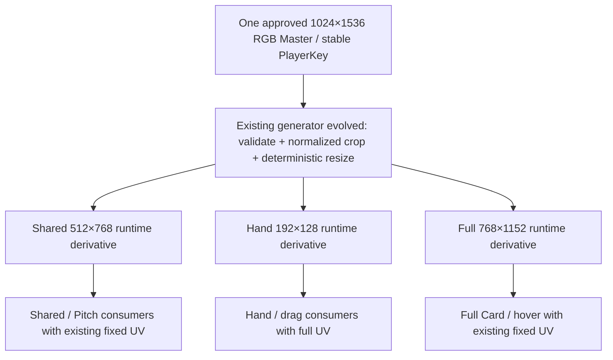

# Player Art Architecture v1 — Canonical Master → Derived Runtime Assets

Stage: `8.1B` · Baseline: `main / 2d33963bdb36f3ea41ba0c6ce2738cd849e82aa1` · Date: `2026-09-10`

Status: **Architecture lock for user acceptance; production migration NOT implemented. Stage 8.1B is not automatically CLOSED.** The user confirms Stage 8.1A accepted and committed at this baseline; shell/Header/Dock work stays closed and out of scope.

This is the **single canonical player-art architecture**. The historical filename is retained to consolidate the existing Shared contract and preserve incoming links. It supersedes that contract's Shared-only source ownership, and the independent Hand/Full authoring and source-workflow rules in [Portrait Asset Spec](Portrait_Asset_Spec_v1.md). [Hand Micro Visual Spec](HandMicro_Visual_Spec_v1.md) still owns frozen card geometry/typography; [Shared Artwork Manifest](Shared_Portrait_Artwork_Manifest_v1.md) remains the historical coverage inventory. Existing assets, v1 manifests, hashes and routing remain valid legacy production until explicitly migrated. This specification is not authorization to generate a roster, import assets, change widgets or delete legacy art.

## 1. Current audit and truth boundaries

The Stage 8.0 source/Texture2D audit remains applicable: no changes between audit commit `46f344779da90475d08a15728de4d14e27ea4f3d` and this baseline in player source art, portraits, ContentSource, the audited generators/importer, PlayerCardWidget or PlayerUIAssetReferences. Targeted 8.1B checks snapshot 264 protected files, re-read actual consumers/settings and inspect three source PNGs. Evidence lives in `Saved/Automation/Stage8_0/` and review-only `Saved/Stage8_1B/`; no repeated full asset scan or new cook is needed.

| Current role | Routes | Imported size / actual settings | Source ownership today |
|---|---:|---|---|
| Shared / Pitch | 28 | 20 at 512×768, BC7, Sharpen1 mips, trilinear; 8 older 1024×1536, Default compression, no mips | Shared-specific masters |
| Hand Micro / drag | 16 | 192×128, BC7, Sharpen1 mips, trilinear | Independently authored 1536×1024 candidates and explicit legacy crops |
| Full Card | 16 | 1024×1536, Default compression, no mips | Separately authored FullCardPilot / FullCardHeroBust PNGs |

All 60 mapped player textures are sRGB, UI group and NeverStream in the saved metadata. `TC_DEFAULT` does not by itself prove a particular cooked GPU format; opaque BC1 was the Stage 8.0 payload assumption. Shared/Hand use BC7 in the current desktop implementation. Current Full importer/validator enforce dimensions, UI and sRGB but do not lock the other settings.

The 40-player coverage is **16 all-three / 12 Shared-only / 12 missing**. This is technical routing coverage, not 16 approved single-master identities. No player is newly certified `ProductionVerified` here. Multiple images are mostly independently maintained art, not exact duplicate PNG hashes. The 90 historical Hand candidates occupy 171.04 MiB; they are not 90 runtime textures.

Runtime truth remains `FFMCodexPlayerUIAssetReferences::ResolveCardArt(CardId)` and the existing presentation DTO. Art metadata never owns stats, rarity, legal actions, phase, score, identity disclosure or localized player names. No Gameplay/CoreRules/Network/PlayerIntent/lifecycle changes are part of this lock.

## 2. Frozen architecture and minimum physical assets



There are **three logical roles and three physical runtime textures per player** in desktop v1. This follows the actual 1440p resolution comparison: Full requires a different size from Shared. They may have the same whole-master framing but cannot alias the same physical texture without either weakening Full quality or making Pitch load the larger texture. No separately authored Pitch image is added. No current mappings are changed in 8.1B.

Pitch Mini continues to use Shared. Its 130×112 region at design scale uses only a portion of the 512×768 image, but preserves the established route without adding another desktop derivative. The crop still retains substantially more source samples than physical display pixels. A smaller generated Pitch or mobile representation requires measured benefit later; it is not a fourth desktop v1 asset by default. If a future platform intentionally uses identical Shared/Full size, crop, hash and recipe, it may explicitly alias those roles; that is a future platform option, not the desktop lock or a missing-art fallback.

## 3. Canonical authored master and composition

| Property | v1 contract |
|---|---|
| Canvas | **1024×1536**, portrait **2:3** |
| Encoding | 8-bit/channel **RGB PNG**, opaque, sRGB-authored; no alpha |
| Ownership | One approved current artistic appearance per stable PlayerKey; source outside `/Game` |
| Subject | One player; complete hair/head, neck, bilateral shoulders, collar, upper torso/chest |
| Composition priority | Identity first, stable face scale/placement, enough width for landscape Hand crop, enough lower shirt for Full hero |
| Background | Subordinate low-noise navy/teal or neutral atmosphere; natural face/kit color, no whole-image ownership tint |
| Exclusions | No names, position, attributes, tactical text, rarity, numbers, UI frames, watermarks, invented club crests, sponsors, manufacturer marks or extra subjects |

Author against all three preview windows, not just the uncropped canvas. The existing global Pitch window is approximately `U 0.0370–0.9630, V 0.0546–0.5865`; Full uses `U 0–1, V 0.045–0.658`; default Hand uses `U 0–1, V 0.045–0.489444…`. Keep head/kit comfortably inside these windows and away from corner pips/Full biography overlays. Do not move widgets, slots, hit testing or UV constants to repair an individual portrait.

Useful **authoring guides**, not extra runtime parameters: centered head, hair top around master Y 0.067–0.09; eyes around 0.205–0.23; chin around 0.35–0.375; shoulders around 0.415–0.455. They map to roughly 5–10% headroom, 36–42% eyes, 69–74% chin and 83–92% shoulders in the default Hand window. Preserve natural anatomy and varied hairstyles; unusual hair must fit, not be clipped to meet a numeric landmark. Confirm these guides on the 8.2 pilot before roster production; repeated crop exceptions require correcting composition.

Keep bright hotspots, hard light strips, halos and busy signage out of the shared face/Hand/Pitch region. Subtle authored lighting or distant stadium atmosphere is permitted where it survives all crops quietly. Existing comparison Full masters with brighter backgrounds are resolution fixtures, not automatically accepted unified masters. Preserve the established original prototype kit families (Arsenal red/white, City sky blue; visibly distinct goalkeeper kit), without treating present prototype assets as release rights clearance.

A separate authored appearance is exceptional: explicit artistic reason, approval/provenance, bounded appearance ID, consumers and replacement/retirement intent. Resolution or aspect ratio alone is not a reason. An approved alternate appearance must itself derive its needed roles from one master; no independently painted Hand/Shared/Full trio. Current primary PlayerKey identity remains stable.

## 4. Runtime derivative and import contract

| Logical role | Dimensions / aspect | Consumer at 1080 design scale | Mips / filtering | Alpha | Desktop recipe / rationale |
|---|---|---|---|---|---|
| Shared | **512×768 / 2:3** | Shared portrait and Pitch Mini, 136×140 card / 130×112 image | Sharpen1 chain / trilinear | None | High-quality compressed sRGB portrait; BC7 reference recipe; enough Pitch crop pixels without loading the larger Full resource |
| Hand | **192×128 / 3:2** | 220×68 card, 96×64 image in 96×68 cell; drag ×1.10 | Sharpen1 chain / trilinear | None | Compressed small surface; never load Shared solely to display Hand |
| Full | **768×1152 / 2:3** | 360×540 card, current hero window; 1440p quality gate below | Same compression/mip family as Shared | None | Visible 1440p hair/beard/kit-detail benefit in controlled review; required distinct size |
| Master | **1024×1536 / 2:3** | Authoring and regeneration only | Not a UE runtime texture | None | Never imported/cooked automatically |

Hand at 1440p occupies 128×85.33 physical pixels, or about 140.8×93.87 during 1.10 drag; 192×128 retains useful headroom without a large portrait load. Keep full-UV, centered 3:2 image, scale 1.0 within the existing card. No individual runtime transform.

Desktop reference import: `Texture2D`, exact derivative dimensions, `TEXTUREGROUP_UI`, `TC_BC7`, `sRGB=true`, `CompressionNoAlpha=true`, `TMGS_SHARPEN1`, `TF_TRILINEAR`, `LODBias=0`, no virtual texture, no unexpected MaxTextureSize clamp. Inspect actual mip count, GPU format and residency in the pilot. Existing generator does not add an artistic sharpen pass; mip filtering is a separately versioned engine recipe. If Sharpen1 creates halos, revise the shared recipe with evidence, not per-player filter settings.

BC7 is **a desktop implementation choice**, not the logical role contract. Future platform cooks may use appropriate ASTC/ETC formats and DeviceProfile/LOD limits. UI2D/uncompressed RGBA is not the universal portrait default. Current opaque composition needs no alpha; a future cutout requires an explicit visual need, new cost assessment and approved recipe, not an unused opaque alpha channel.

Current UE5.3 UI textures are non-streamable (`UTexture::IsPossibleToStream` rejects UI group), and these NPOT dimensions also constrain streaming. Record `NeverStream=true` as the present desktop reality, not a promise that all portraits must be loaded forever. Mips and asset-level lifetime are distinct from texture streaming. Do not pad to a power-of-two canvas or change UV geometry casually to toggle streaming.

## 5. Full Card resolution evidence

**Decision: recommend / lock Full at 768×1152 for desktop v1.** 512 remains usable, but does not meet the requested effectively-indistinguishable quality threshold in this comparison. This is a visual-quality choice, not extra safety margin.

Use three existing current 1024×1536 RGB Full masters: Bukayo Saka, Rodri and David Raya (`FullCardPilot_02`). Their source paths, SHA-256 and both generated sizes are in `Saved/Stage8_1B/resolution_sources.json`. No new player artwork, production import or route replacement is involved; these sources are resolution fixtures, not newly approved unified masters.

The isolated UE5.3 `-game` review copies each player's existing real presentation DTO into the **actual `UFMCodexPlayerCardWidget` class**, `InteractionChoice` mode. It displays three 360×540 cards, changing only the hero image resource to `/Engine/Transient` textures loaded from review PNGs. The production full-width UV window `U 0–1, V 0.045–0.658`, biography overlay, data text, frame and card hierarchy are preserved. The gallery positions are review-only, not a proposed screen layout.

| Output | Actual card condition | 512 vs 768 observation |
|---|---|---|
| 1920×1080, DPI 1 | 360×540 card; 348×320 hero inside the frame | Both read well; 768 preserves more hair/skin/cloth microcontrast. Difference is smaller than at 1440p; 512 is usable at this scale |
| 2560×1440, DPI 4/3 | 480×720 card; about 464×426.7 hero | 512 visibly smooths Rodri/Raya beard and hair, Saka short-hair texture and Raya shirt weave. 768 retains these details without a change of identity, crop or layout; this is not effectively indistinguishable at maximum size |

The full frame dimensions follow actual screenshot borders and the unchanged 360×540 class bounds/DPI; hidden-window Slate geometry access returned zero and is **not** used as measurement evidence. The hero dimensions also follow the current 6-pixel frame inset and 320-pixel height in C++. Screenshot crops retain original pixels and are not enlarged or sharpened. Numeric differences are supporting evidence only, not a substitute for the visual judgment.

Review deliverables: `Full_Card_1080_comparison.png`, `Full_Card_1440_comparison.png`; raw full-screen `UE_1920x1080_Full512.png`, `UE_1920x1080_Full768.png`, `UE_2560x1440_Full512.png`, `UE_2560x1440_Full768.png` under `Saved/Stage8_1B/`. Only these successful final captures belong to the evidence set; earlier harness attempts are not quality evidence.

**Evidence limit:** these are uncompressed transient RGB-derived textures, using the same sampling/crop path, for a controlled resolution decision. They are not imported BC7/mip-chain or cooked-quality acceptance. Stage 8.2 must confirm the selected 768 recipe in actual production imports at the same scales. No Full Card redesign, larger zoom, 4K guarantee, USER PIE acceptance or new-master conformance is claimed. If implementation evidence contradicts this comparison, revise the recipe explicitly before bulk production.


## 6. Minimal normalized crop metadata

Extend the existing manifest/schema, not Widget code. Each player record identifies `playerKey`, `masterSourcePath`, `masterRevision`, `masterSha256`, approval/provenance and `compositionProfile=HeroBust_v1`. Defaults are shared constants in the generator. Only optional `handCropRect` and `fullCropRect` are permitted framing exceptions; there is no duplicate focus/face/zoom system.

Rectangles are `[x, y, width, height]` in **normalized master coordinates**, top-left origin. Default Shared/Full `[0,0,1,1]`; default Hand `[0,0.045,1,4/9]`. For a 2:3 master, Hand must satisfy `height = width × 4/9`; a distinct 2:3 Full crop must satisfy normalized `height = width`. All coordinates finite and inside `[0,1]`, positive dimensions, no out-of-bounds padding or nonuniform stretch. Desktop v1 always generates the separate 768×1152 Full output; no automatic role fallback or alias.

Convert the normalized rect directly to floating source pixel bounds; run one pinned Pillow Lanczos resize from that source box to the output size. No integer pre-crop then chained up/downsample, auto face detection, resynthesis, or manual derivative edits. Record resolved pixel bounds and final hashes. Shared remains uncropped in v1; repair its master if the frozen Pitch crop fails. Each exceptional crop needs a visible defect, rationale and review of all affected consumers; most pilot players should use defaults. A majority needing exceptions fails the composition pilot.

Hash fields and resolved outputs below are structural examples, not production records:

```json
{
  "playerKey": "Prototype.Arsenal.BukayoSaka",
  "masterSourcePath": "ArtSource/UI/PlayerMaster/Prototype.Arsenal.BukayoSaka/Master.png",
  "masterRevision": 1,
  "compositionProfile": "HeroBust_v1",
  "cropOverrides": {},
  "roles": {
    "Shared": {"recipe": "DesktopPortrait512_v1"},
    "Hand": {"recipe": "DesktopHand192_v1"},
    "Full": {"recipe": "DesktopFull768_v1"}
  }
}
```

## 7. Paths, provenance and deterministic replacement

| Layer | Future convention | Cook / version policy |
|---|---|---|
| Authored source | `ArtSource/UI/PlayerMaster/<StablePlayerKey>/Master.png` | Not under Content; never automatically cooked; revision/hash in manifest |
| Catalog | Evolve existing `ArtSource/UI/PrototypeTeams/SharedPortraitImportManifest.json` to schema v2 with all logical roles | One inventory; historical filename does not imply separate Shared art ownership |
| Generated import PNGs | `ContentSource/UI/PlayerPortraitRuntime/<StablePlayerKey>/Shared.png`, `Hand.png`, `Full.png` | Reproducible import inputs, not runtime/cook roots |
| Derived provenance | `ContentSource/UI/PlayerPortraitRuntime/PlayerArtProvenance.json` | One record of resolved roles, source and output hashes; preserve old v1 provenance during migration |
| UE textures | `/Game/UI/Portraits/PrototypeTeams/Canonical/<KeyToken>/T_<KeyToken>_Shared`, `_Hand`, `_Full` | Only these imported assets enter runtime; keep cook inclusion explicit |
| Review | `Saved/Stage8_1B/`, later stage-specific Saved directories | Ignored; never production imports/routes |

`KeyToken` is the validated stable PlayerKey with dots replaced by underscores, e.g. `Prototype_Arsenal_BukayoSaka`; validate collision-free conversion and reject unsupported tokens. Never derive identity/path from localized name, DisplaySerial or current display club. Do not put temporary candidate serials in production names. Existing legacy paths remain until migration; no rename is performed here. The existing `DirectoriesToAlwaysCook=/Game/UI/Portraits/PrototypeTeams` covers the proposed runtime subtree; source and generated PNG folders are outside `/Game`.

Provenance records source origin/reference, usage-rights/approval status, author/tool version where known, master SHA-256 and revision, composition/crop metadata hash, generator version, pinned Pillow version, resampler/encoder settings, generated output dimensions/bytes/SHA-256, role-to-resource bindings, UE destination/import source hash, engine/import recipe version and per-surface visual acceptance. Unknown provenance stays unknown; technical coverage cannot grant art/legal approval. Retain superseded revision/hash history; keep one active master, using repository history or designated source archive for older approved versions rather than copying every review render into runtime content.

Replacement transaction: review new master → approve/revise metadata → validate master → regenerate every required role directly from that revision → byte-repeatability/hash checks → import only selected changed runtime assets → fresh-load exact-path/settings validation → Hand/Pitch/Full comparison → confirm/switch all selected routes together. Stage the candidate alongside current approved production until gates pass; a failure leaves current routes intact. No three unrelated manual edits, partial mixed-revision identity, or direct Master soft path in a widget.

## 8. Evolve the existing pipeline in Stage 8.2

| Existing entry point | Audit result | Bounded next change |
|---|---|---|
| `SharedPortraitImportCatalog.py` | Shared-only schema v1, team/name validation, optional PlayerKey selection | Extend same catalog to schema v2 paths, logical roles, crop bounds and provenance; keep unmigrated v1 reproducible |
| `GenerateSharedPortraitRuntimeDerivatives.py` + `requirements-shared-portrait.txt` | Pinned Pillow **9.4.0**, RGB 1024×1536 validation, uncropped Lanczos to 512×768, repeated encode, atomic write-if-changed, hashes | Evolve this generator for Hand and Full; one direct resize per role; record source and output hashes; no second generator engine |
| `GenerateHandMicroPortraits.py` | Hardcoded 16 candidate/crop/landmark entries, 1536×1024 approved views and 192×128 outputs, frozen SHA pairs; executes at top level | Preserve legacy reproduction mode; future master-derived Hand calls the evolved shared generator/catalog. Do not retune frozen legacy hashes to disguise changed inputs |
| `ImportPrototypeTeamUIAssets.ps1/.py`, `ValidatePrototypeTeamUIAssets.py` | Existing preprocessor/import/fresh-validation workflow and exact Shared recipe | Extend selectors and per-role settings; validate output source hashes, imported size, mips/format and same-player source identity |
| `ImportHandMicroPortraits.py`, `ValidateHandMicroPortraits.py` | Hardcoded legacy asset inventory, strong settings checks | Retain wrapper compatibility; consume unified selected records for migrated players; do not import 1536×1024 review images |
| `ImportFullCardPilotPortraits.py`, `ValidateFullCardPilotPortraits.py` | Hardcoded 16 independent 1024 sources; importer only sets UI/sRGB; validator only asserts size/UI/sRGB | Replace migrated Full inputs with generated role and exact recipe validation through the same pipeline; retain legacy validation for untouched players |
| `TestSharedPortraitRuntimeDerivativePipeline.py` | Existing deterministic preprocessing test seam | Extend focused cases for default/exception crop, stale hash, role isolation and selected-player isolation when implementation changes |

Do not build a universal asset framework, a second manifest authority or a new production generator in 8.1B. The Saved scripts used for this stage are review harness/calculation tools only, not a competing import pipeline.

## 9. Missing art and completeness

Track a master gate plus **per-role** progress; these are pipeline facts, not new gameplay DTO enums. `MasterMissing`: no acceptable source. `MasterReady`: source meets the spec and has approval/hash. `DerivedMissing`: a required role is absent or stale against master/metadata/recipe. `DerivedReady`: all required derivatives validate. `Imported`: exact Texture2D path, source hash and settings validate in a fresh load. `ProductionVerified`: actual routes and all three surface acceptance gates pass for the same approved revision. Replacing a master invalidates downstream readiness until regenerated/reverified.

Neutral missing presentation keeps the correct data-driven name/position over the existing restrained fallback surface. Never borrow another player's art. Never silently count a wrong/missing role as complete because some other route has an image. Current Prototype Full null binding stays blank; current Hand failed-load fallback can use the same player's Shared, but is degraded coverage, not the future Hand contract and not a reason to load large art on every Hand. No new fallback UI is implemented here.

**Art complete** means approved canonical master + every required generated role + valid provenance/hashes + correct imports + exact production routes + Hand/Pitch/Full visual acceptance (including Full at 1440p). `File exists`, old three-route coverage and automated capture are insufficient. User visual acceptance remains required at the implementation milestone.

## 10. Localization and mobile boundaries

All names, position, attributes, tactical roles/descriptions, rarity labels, statistics, score and buttons remain data/UI-rendered. Follow [Player Display Name Contract](Player_Display_Name_Contract_v1.md): stable PlayerKey is lookup identity; resolved `FText`/presentation values own display text. Changing language cannot change a master, crop or filename. Player art must never bake Chinese or another locale into a portrait. Stadium branding/decor is a separate art system.

Future mobile landscape can reuse the same authored masters, normalized crop metadata and logical roles, with smaller generated representations or DeviceProfile/LOD/platform compression. Do not implement mobile UI, device-specific layout, new streaming or platform cooks here. NPOT, format/mip support, ASTC/ETC quality and actual device residency must be proven before choosing a mobile recipe; PC BC7 and permanent residency are not architectural requirements.

## 11. Runtime loading / residency audit and future gate

`UFMCodexPlayerCardWidget::RefreshPresentationArt()` calls `LoadSynchronous`. For Hand it selects Shared as `ActivePortrait`, then also loads Hand; for Full it selects Full then also loads Hand. Role/skill icon loads are additional and outside this portrait optimization. The UPROPERTY texture members and image brushes hold strong references. The detail overlay's hide path only collapses visibility; it does not promise to release its last Full portrait. Thus small displayed pixels currently do not imply small loaded resources.

| Surface | Actual need | Stage 8.2 loading contract to prove |
|---|---|---|
| Hand/racks/drag | Small Hand image for visible roster; no Shared required to render it | Load/bind Hand only; unused portrait fields/brushes must not keep Shared/Full alive solely for Hand |
| Pitch/deployed state | Shared portrait for displayed deployed cards | Acquire when needed, reuse by stable resource identity; no Full load solely for Pitch |
| Full hover/detail | Hero only while shown or deliberately cached | Acquire the Full logical role on demand; bounded warm cache/lifetime rather than preload every Full; release unused brush/member references on eviction |
| Unused roster players | No visible surface | Do not load all 100–200 portraits just because the catalog knows them |

`UImage::SetBrushFromTexture` also forces resident mips/ignores streaming bias for its assigned UI texture. Merely changing `NeverStream` is not a loading solution. Preserve responsive hover/drag when testing any async/cache choice. Stage 8.1B does not redesign loading; Stage 8.2 must measure texture objects/unique resources and payload before/after, not merely compare file sizes. Frames, icon atlases, render targets, temporary buffers, GPU allocation alignment and engine/DDC costs are separate.

## 12. Footprint model

All values are **MiB (2^20 bytes)**. Future fully covered rosters assume one Shared 512×768, one Hand 192×128 and one Full 768×1152 per player. No legacy deletion savings are credited.

| Players | A: masters | A: generated PNGs | A: source total | B: editor uasset estimate | C: loose cooked estimate | D: all-player texture payload |
|---:|---:|---:|---:|---:|---:|---:|
| 40 | 91.82 | 70.26 | 162.08 | 83.09 | 66.55 | 66.26 |
| 100 | 229.55 | 175.66 | 405.20 | 207.72 | 166.37 | 165.64 |
| 200 | 459.09 | 351.32 | 810.41 | 415.45 | 332.75 | 331.28 |

**A — source/repository inputs:** the three existing RGB masters average 2,406,955 bytes (range 2,307,527–2,553,872). Measured generated PNG means: Shared 546,482; Full 1,262,336; Hand 33,097 bytes. Three art samples provide a planning estimate, not a guaranteed compression ratio for 200 players. Excludes Git history, archived candidates, Saved reviews and small provenance overhead. Working-tree repository footprint including editor assets is **A + B**, not A alone. During migration retained legacy content adds to these figures.

**B — imported editor files:** current measured Shared assets average 0.625227 MiB (20 samples), Hand 0.045247 MiB (16). With no 768 import allowed in this stage, estimate Full as Shared ×2.25 pixel ratio = 1.406761 MiB. Source compression and serialized metadata are not exactly linear; B is a planning proxy, not a new import measurement or a cooked-size claim.

**D — runtime texture payload:** BC7 uses 16-byte 4×4 blocks. Sum `ceil(w/4) × ceil(h/4) × 16` across all mips down to 1×1, halving dimensions with floor/minimum one. Shared = **524,320 bytes**, Hand = **32,800 bytes**, Full = **1,179,744 bytes**; one complete player = **1,736,864 bytes / 1.656403 MiB**. This excludes alignment, allocators, transient decoding, UObject/RHI costs, icons and frames. It is not measured VRAM/process memory. All-player residency is a capacity scenario, not the intended loading policy.

**C — cooked/package estimate:** D plus an illustrative **2.5 KiB metadata allowance per physical asset**. Existing August loose-cook data has about 2 KiB overhead per portrait, but is not a current Shipping build. C is approximate uncompressed loose-cooked payload; IoStore/Pak compression, alignment and other package content are not predicted. No new Shipping cook.

**Cost of the quality decision:** Full 768 is about 2.25× the payload of Full 512 with the same BC7/mip policy. A hypothetical three-role 512 Full model gives D 41.25 / 103.13 / 206.27 MiB for 40 / 100 / 200 players. If such a lower-quality platform also explicitly aliases identical Shared/Full outputs, it becomes 21.25 / 53.13 / 106.26 MiB. Neither alternative is the selected desktop contract.

Current incomplete 40-player production portrait payload was estimated at **28.5011 MiB** in Stage 8.0 (Shared 16.0006, Full 12.0000, Hand 0.5005); mapped editor portrait files total about **73.00 MiB**. Do not compare incomplete current coverage to a future complete roster as a measured saving. Current 1024 Full opaque-BC1/no-mip assumption is 0.75 MiB each; the proposed 768 BC7/full-mip representation is **1.1251 MiB**, so fewer pixels do not imply less GPU payload across different compression/mip policies.

Mode-appropriate residency is therefore essential: 40 visible Hands need **1.2512 MiB** payload; add **0.50003 MiB per needed Shared** and **1.12509 MiB per needed Full**, rather than loading every role for the whole catalog. Stage 8.2 must demonstrate actual improved runtime behavior; this stage claims no implemented memory reduction.

**Conceptual mobile option — not implemented or measured:** same masters/crop metadata → Shared/Full 256×384 explicit alias plus Hand 144×96, ASTC 6×6 and full mip chain. A 16-byte-per-6×6-block ceiling model yields 40 players **2.5720 MiB**, 100 **6.4301 MiB**, 200 **12.8601 MiB** if all loaded. This intentionally lowers the desktop quality envelope; platform support, format/minimum-block behavior, alignment and visual quality require cook/device verification. DeviceProfile LOD limits or a different platform compression can also be used without changing source ownership.

## 13. Legacy migration and cleanup gates

| Classification | Current examples | Action |
|---|---|---|
| **KEEP — CURRENT PRODUCTION** | 28 Shared, 16 Full, 16 Hand routes and dependencies | Leave intact until the corresponding selected player passes replacement acceptance |
| **MIGRATE — REPLACED BY MASTER-DERIVED ASSET** | 8 old large Shared; 16 independent Full; 16 independently authored Hand; newer Shared source ownership | Future target, not a deletion permission. Re-evaluate all 40 against one-master coverage; technical 16/12/12 is not the migration completion ledger |
| **LEGACY REVIEW** | Historical candidates, approved Hand review canvases, source prototypes/Golden comparisons | Retain evidence/provenance as needed; never cook solely for review |
| **SAFE-LOOKING CLEANUP CANDIDATE** | Unrouted old candidates/derivatives after successful migration | Candidate only; inspect scripts/docs/source references and reproduction needs first |
| **UNKNOWN / REQUIRES REFERENCE AUDIT** | Empty Asset Registry referencers with possible native paths, ambiguous Golden/DEV content | No inference of safety; resolve C++ strings, cook inclusion, source manifest and diagnostic consumers |

The 90 Hand candidate sources become unnecessary as *active production inputs* only after master-derived Hand is accepted, routes switch, the generator no longer depends on them, and source/docs/scripts/native soft-path/cook reference audits are complete. Preserve rights/provenance or essential historical baselines where needed. Cleanup is a separate controlled stage, user-owned under Git safety. **Nothing is deleted, moved, imported or rerouted in 8.1B.**

## 14. Stage 8.2 pilot and Stage 8.3 entry gate

Recommend **Bukayo Saka, Rodri, David Raya, Erling Haaland** (stable keys in the existing catalog): Arsenal outfield/dark-skin and kit contrast; City outfield/hair and beard detail; goalkeeper/different kit; optional fourth case with fair skin, long/light hair and shoulder framing. The resolution proof uses only the first three existing masters. No new artwork is produced here.

Pilot acceptance must prove one approved master produces all roles with consistent identity; sharp Hand at 1080/1440 and drag; readable fixed-crop Pitch with kit/hair and pips; Full quality at true 1440p maximum; default crops for most players and justified minimal exceptions; byte-reproducible generation and complete hashes; exact selected import/reimport settings and source paths; correct distinct role binding; improved **actual** mode-appropriate residency/cost; unchanged data/localization and no player-specific Widget parameters. Check missing/stale art paths and preserve old production until the pilot passes. Rendering evidence supplements USER PIE, never substitutes for it.

Only after acceptance may Stage 8.3 bulk-complete the **24 technically incomplete** players and migrate legacy artwork safely. The other 16 still need single-master conformance; do not assume they require no migration. No Stage 8.2 implementation, bulk generation or cleanup is authorized by this document alone.

## 15. Verification and evidence boundary

Stage 8.1B used the root contract, current native source and existing Stage 8.0 inventory/metadata, then targeted checks only. `Saved/Stage8_1B/prepare_review.py` generates six resolution fixtures from three current masters and snapshots protected source/import/script files; `capture_review.py` runs the production Full Card class in an isolated UE process using transient textures and real DTOs; `build_comparisons.py` arranges unchanged screenshot pixels; `calculate_footprint.py` reproduces the separate source/editor/cooked/payload estimates; `verify_stage.py` records checks in `verification.json`.

Results: **264 protected files unchanged**, **6 deterministic resolution derivatives**, **60 existing mapped texture metadata records checked**, **4 successful native UE screenshots at the requested resolutions**, **12 screenshot frame bounds confirmed within raster rounding**, and unchanged non-hero card pixels between sizes for every player/resolution. New canonical/precedence links resolve. The runtime class and requested fixed bounds plus screenshot borders supply geometry evidence; zero hidden-window Slate geometry entries are explicitly not valid measurements.

No C++/public-header/uasset/production-tool change: no UHT/build, gameplay suites, CoreRules, broad Runtime/LocalPlay/NetworkPlay or real Host/Remote Golden Path. Those would not validate a documentation/resolution-only lock. No Shipping/mobile cook; current import metadata is reused only after the art/runtime baseline comparison and protected hash checks. The selected compression/mips, unified-master appearance, Hand/Pitch crops, loading implementation and USER PIE remain Stage 8.2 acceptance work. `REGRESSION SCOPE JUSTIFIED: YES`. No technical evidence here automatically closes the stage.


## 16. Stage 8.2A accepted Hand implementation and separated activation

Hand production pilot: **USER PIE ACCEPTED** for Saka, Rodri, Raya and Haaland. Pitch Mini implementation is deferred to Stage 8.2B; Full implementation is deferred to Stage 8.2C. The architecture in sections 1–15 remains the accepted Stage 8.1B contract. Future logical roles do not mean those new production routes are active today.

The existing SharedPortraitImportManifest remains the sole inventory (schema 2). Four `ArtSource/UI/PlayerMaster/<PlayerKey>/Master.png` files are byte-identical copies of the retained production source art, with source paths, hashes and revision 1 recorded. Rights provenance is unchanged. Master remains source-only, 1024×1536 opaque RGB; no Master runtime route is introduced.

Only `ContentSource/UI/PlayerPortraitRuntime/<PlayerKey>/Hand.png` and `/Game/UI/Portraits/PrototypeTeams/Canonical/<KeyToken>/T_<KeyToken>_Hand` are active new derivatives. Hand is 192×128. The four players' legacy Shared/Pitch and Full paths remain production paths. Their deferred new 512×768 Shared and 768×1152 Full candidates are not required by Hand generation, import, tests or runtime.

### Accepted composition and imports

`BalancedBust_v2` uses normalized `[x,y,width,height]` crop `[0,.055,1,.5]` for Raya/Rodri and `[0,.115,1,.475]` for Saka/Haaland. The existing Master supplies every subject pixel. Offline seeded GrabCut extracts a silhouette with a shared trimap and crop-relative crown seed, using 512×768 analysis only for the mask. Final RGB samples the original Master directly once, preserves proportions and composites onto a quiet navy background. The mask is not a runtime asset. No face synthesis, kit replacement or new independent Hand art source is used.

Build-only dependencies are pinned by `Scripts/PlayerPortraitBuildRequirements.txt`: Pillow 9.4.0, NumPy 1.24.1, opencv-python-headless 4.10.0.84. Extraction uses seed 0, one thread, six iterations, the face-connected component and a half-pixel analysis-mask edge smoothing. This is a reviewed four-player recipe, not a bulk-migration approval.

The existing import wrapper uses explicit player and role selection:

```powershell
./Scripts/ImportPrototypeTeamUIAssets.ps1 -PlayerKeys @('Prototype.Arsenal.BukayoSaka','Prototype.Arsenal.DavidRaya','Prototype.ManchesterCity.Rodri','Prototype.ManchesterCity.ErlingHaaland') -RuntimeRoles Hand
```

Empty canonical role selection fails instead of implicitly generating future roles. Legacy Shared-only operations retain their original behavior. Canonical role sizes/path helpers remain shared architecture. The importer retains UI/BC7/Sharpen1/Trilinear/sRGB/LOD0, opaque, nonvirtual, unclamped settings and UE5.3 NPOT NeverStream. This does not prescribe mobile compression or assert Shipping size.

### Provenance and first generation

Active PlayerArtProvenance contains four Hand records, Master identity/revision/hash, normalized crop/pixel box, output dimensions/path/hash, generator source hash and pinned recipe. Hand is accepted; Shared and Full are explicitly deferred. This is not family-level ProductionVerified.

Generator version 5 supports a first Hand generation with no provenance file or future-role records. Missing unselected roles are not generated. Existing unselected records are retained only if their Master, revision, crop, path, dimensions, recipe and output bytes remain valid; otherwise the partial operation fails before publication. Frozen Hand also checks its composition and generator hash. A fresh output is not automatically visually accepted; acceptance is retained only for unchanged Master revision/crop/output bytes. Source, metadata, generator and output drift block import.

### Hand display and loading

Hand remains 220×68 with 96×64 portrait rendering, 120×68 information allocation and the existing 2×10 rack. Final frame/hover/number tokens are in HandMicro Visual Spec section 33. Only Hand activates the new native identity surface and four-side frame. Other widget purposes use retained production styling.

The optional `AssignedPlayerNumber` passes from the read-only card view through MakeCard into the UMG model. Production values remain empty. Hand alone displays a nonempty number; the catalog serial is independent. There is no editor, guessed default, persistence or network change. Names/positions remain the existing localized display projection.

Canonical Hand and its drag proxy acquire only the Hand portrait, skip unused frame/role/skill textures and clear large portrait members/brushes on return from another purpose. Legacy Pitch/Full resolution is retained; an intentional Full hover may load/cache the old Full texture independently. Hiding Full is not a guarantee of immediate UObject/RHI memory release. No global portrait cache or full-roster preload is added.

The accepted Hand PNGs total 106,017 bytes; four editor packages total 149,167 bytes. Prior Development/D3D12 evidence reported 36 KiB per Hand (144 KiB for four); that is UE's resident allocation estimate, not physical VRAM or Shipping size. Separation changes generator/crop metadata hashes, not accepted portrait bytes or UE packages.

## 17. Historical combined candidate and rejected framing

The initial uncommitted three-surface pilot introduced new Shared/Full routes, Full crop/style changes and combined tests. These were never accepted as Stage 8.2B/C. Closeout preserves the complete incoming files, provenance and deferred PNG/uasset candidates in the ignored verified Stage8_2A_CloseoutBackup; they are removed from active production activation.

The subsequent UpperTorsoNavy_v1 framing was rejected for undersized faces and fading shoulders. It is historical evidence only and is not a supported production generator branch. BalancedBust_v2 supersedes it. Earlier frame refinements are superseded by Hand spec section 33; section 34 records acceptance and separation.

## 18. Verification boundary

Closeout uses focused Hand pipeline tests, the retained legacy derivative tests, Hand UI automation and specifically affected old Pitch/Full anchors, an incremental Development Editor/UHT build, hashes, diff checks and one fresh Hand runtime check. Technical checks do not create new visual acceptance: the user already accepted Hand. A changed Hand render would reopen USER PIE; unchanged separation does not require repeating it. No broad gameplay/network suites, real Host/Remote path, Shipping/mobile cook, legacy art cleanup or automatic commit.


## 19. Stage 8.2B Shared/Pitch pilot activation (pending USER PIE)

Section 16 describes the accepted Hand closeout baseline. Stage 8.2B now activates only the four pilot players' Shared derivatives for PitchMini through a separate PitchMiniPortrait soft reference. Generic Portrait/PitchCompact and FullCardPortrait retain their old production routes. Hand remains accepted and byte-identical; this does not reactivate the historical Full candidates from section 17.

The logical sizes and single-Master ownership remain unchanged. The bounded QuietPitchBust_v1 composition adds pitchCompositionProfile and pitchCropRect for Shared: Saka/Haaland [0,.115,1,.64], Raya/Rodri [0,.055,1,.64]. This intentionally supersedes the uncropped-only Shared restriction for these four pilots, because the frozen Pitch UV otherwise hides their chest and exposes strong light blobs. One offline proportional sampling of the original Master and the existing seeded silhouette mask gives a quieter navy Shared canvas; no runtime mask, extra source identity, runtime per-player transform or dynamic text texture is added. See PitchMini Visual Target section 19 for exact presentation tokens.

Generator version 6 records Shared composition/generator hashes and validates frozen role recipes. All selected outputs remain deterministic; Hand re-encoding preserves its accepted PNG bytes and imported packages while updating generator/crop metadata. Active provenance roles are Hand (USER PIE ACCEPTED) and Shared (PENDING USER PIE), with Full DEFERRED. Missing future roles remain optional; existing unselected roles cannot become stale silently.

Import only explicit RuntimeRoles Shared for the four player keys, using the existing wrapper. The recipe remains opaque RGB 512x768, BC7, Sharpen1, trilinear, sRGB, UI group, LOD0 and current UE5.3 NeverStream. Only four new Shared uassets enter /Game. The native card frame adds two inexpensive rounded-outline draws and no material or extra texture. Hand and Pitch may coexist on screen, but each pilot widget retains only the texture appropriate to its purpose; old Full hover remains a separate intentional load.

Validation is limited to the affected Pitch geometry/color/pip and role-isolation tests, Hand and old Full anchors, deterministic Hand/Shared generation and legacy pipeline tests, incremental UHT/build, import validation, protected hashes and native UE screenshots. USER PIE remains required; no automatic Stage close or commit.

## 20. Stage 8.2B.1 Shared/Pitch composition refinement

Supersedes section 19's .64 crop height and plain-gradient background. Keep the same four Masters, existing QuietPitchBust_v1 branch, source paths, role sizes and BC7 import recipe. Generator revision 7 records the .55-height guides and restrained stadium background; the bounded Pitch crop validator permits height .54..70. Existing top offsets remain .115 for Saka/Haaland and .055 for Raya/Rodri. There are no new player exceptions or runtime transforms.

Offline original-Master subject extraction and proportional sampling remain unchanged. Smooth navy ambient light and dim defocused side banks are composed behind the silhouette into the existing opaque 512x768 Shared output. No extra texture family, mask resource, noise layer or runtime material is introduced. Runtime BC7 dimensions/mips and texture count remain unchanged; source/editor-package compressed sizes are evidence, not a Shipping/mobile size claim.

A generator-source change requires explicit Hand+Shared re-encoding to refresh recipe hashes. Accepted Hand output bytes and packages must stay identical, preserving Hand acceptance. Import/reimport remains Shared-only for the same four keys; Full is still DEFERRED. Common Pitch chrome/name layout also applies to legacy portraits without migrating their assets, and all Pitch cards skip unrelated frame/Hand/skill/role texture acquisition. The scoped importer, missing/stale source gates, canonical identity and future-role isolation remain in force. USER PIE is still required for Pitch refinement.

The Shared canvas fades only unused lower-torso detail below the frozen Pitch UV, after a .025-canvas-height mip margin and across a .095-height smooth transition. This reduces source/editor-package entropy without changing visible head/shoulder/shirt framing, adding an asset, or introducing player-specific runtime behavior.

## 21. Stage 8.2B.2 localized stadium-light polish

Generator revision 8 changes only the existing Shared/Pitch background bank pixels. The Master, .55 crop heights, crown offsets, subject extraction/sampling, unused lower-canvas fade and Hand/Full recipes remain unchanged. Base navy exposure and broad halo coefficients stay fixed; localized head/shoulder side banks gain modest softness/intensity. Text is still drawn by UI over the unchanged dark information bar. No additional texture family or runtime lighting/compositing pass is introduced for the atmosphere.

Explicit Hand+Shared generation refreshes generator hashes, retaining byte-identical accepted Hand PNGs. Reimport only the same four Shared packages. Texture count, 512x768 resolution, BC7/Sharpen1/trilinear/sRGB/UI/LOD0/NeverStream settings and runtime mip allocation remain unchanged. The separate native contact contour is one inexpensive unfilled Slate element per Pitch card, with no material, texture, blur or dynamic mask. Full stays deferred and legacy portraits keep their existing source routes. Reduced verification and remaining USER PIE gate are recorded in Pitch Mini visual target section 21.
